# 自动化平台 CI/CD 部署指南

## 📋 概述

本文档提供了自动化测试平台的完整 CI/CD 部署方案，包括 Jenkins 流水线配置、Docker 容器化部署、多环境管理等。

## 🏗️ 架构概览

```
┌─────────────────┐    ┌─────────────────┐    ┌─────────────────┐
│   开发环境      │    │   预发布环境    │    │   生产环境      │
│   (dev)         │    │   (staging)     │    │   (production)  │
├─────────────────┤    ├─────────────────┤    ├─────────────────┤
│ • 快速迭代      │    │ • 性能测试      │    │ • 高可用        │
│ • 调试友好      │    │ • 集成验证      │    │ • 安全加固      │
│ • 开发工具      │    │ • 监控完整      │    │ • 生产就绪      │
└─────────────────┘    └─────────────────┘    └─────────────────┘
```

## 📁 文件结构

```
project/
├── Jenkinsfile.deploy              # 主要的 CI/CD 流水线
├── scripts/
│   ├── deploy.sh                   # 远程服务器部署脚本
│   ├── health-check.sh             # 健康检查脚本
│   └── rollback.sh                 # 回滚脚本
├── deployment/
│   ├── docker-compose.prod.yml     # 生产环境配置
│   ├── docker-compose.staging.yml  # 预发布环境配置
│   ├── docker-compose.dev.yml      # 开发环境配置
│   ├── .env.production             # 生产环境变量
│   ├── .env.staging                # 预发布环境变量
│   └── .env.dev                    # 开发环境变量
└── Jenkinsfile                     # 测试执行流水线（已存在）
```

## 🚀 快速开始

### 1. Jenkins 配置

#### 创建 Pipeline Job

1. 在 Jenkins 中创建新的 Pipeline 项目
2. 配置 Git 仓库地址
3. Pipeline script 设置为 `Pipeline script from SCM`
4. Script Path 设置为 `Jenkinsfile.deploy`

#### 必需的 Jenkins 插件

```bash
# 核心插件
- Pipeline
- Git Plugin
- Docker Pipeline
- SSH Agent
- Email Extension

# 可选插件
- Blue Ocean（更好的界面）
- Pipeline: Stage View
- Build Timeout
- Timestamper
```

#### 配置 Jenkins Credentials

在 Jenkins 中配置以下凭据：

| Credential ID | 类型 | 描述 |
|--------------|------|------|
| `docker-registry-url` | Secret text | Docker 仓库地址 |
| `docker-registry-credentials` | Username/Password | Docker 仓库凭据 |
| `deploy-host` | Secret text | 部署服务器地址 |
| `deploy-user` | Secret text | 部署用户名 |
| `deploy-ssh-key` | SSH Username with private key | SSH 私钥 |
| `db-host` | Secret text | 数据库地址 |
| `db-credentials` | Username/Password | 数据库凭据 |
| `jwt-secret` | Secret text | JWT 密钥 |
| `jenkins-api-key` | Secret text | Jenkins API 密钥 |

### 2. 服务器准备

#### 系统要求

```bash
# 最低配置
- CPU: 2 核
- 内存: 4GB
- 磁盘: 50GB
- 网络: 10Mbps

# 推荐配置（生产环境）
- CPU: 4 核
- 内存: 8GB
- 磁盘: 100GB SSD
- 网络: 100Mbps
```

#### 安装必要软件

```bash
# Docker 安装
curl -fsSL https://get.docker.com -o get-docker.sh
sudo sh get-docker.sh
sudo usermod -aG docker $USER

# Docker Compose 安装
sudo curl -L "https://github.com/docker/compose/releases/download/v2.21.0/docker-compose-$(uname -s)-$(uname -m)" -o /usr/local/bin/docker-compose
sudo chmod +x /usr/local/bin/docker-compose

# 其他工具
sudo apt-get update
sudo apt-get install -y curl wget jq git
```

#### 目录结构创建

```bash
# 创建应用目录
sudo mkdir -p /opt/automation-platform/{data,logs,backups,configs}
sudo chown -R $USER:$USER /opt/automation-platform

# 创建日志目录
sudo mkdir -p /var/log/automation-platform
sudo chown -R $USER:$USER /var/log/automation-platform
```

### 3. 部署流程

#### 手动部署（首次部署）

```bash
# 1. 复制部署文件到服务器
scp -r deployment/* user@server:/opt/automation-platform/

# 2. 配置环境变量
cp /opt/automation-platform/.env.production /opt/automation-platform/.env
# 编辑 .env 文件，填入实际配置

# 3. 执行部署
cd /opt/automation-platform
./deploy.sh production recreate your-registry/automation-platform:1.0.0
```

#### 自动部署（Jenkins）

1. 在 Jenkins 中运行 Pipeline
2. 选择部署环境（dev/staging/production）
3. 选择部署策略（rolling/blue-green/recreate）
4. 等待部署完成
5. 查看健康检查结果

## 🔧 部署策略详解

### Rolling Update（滚动更新）

```mermaid
graph LR
    A[当前版本] --> B[启动新版本]
    B --> C[健康检查]
    C --> D[停止旧版本]
    D --> E[完成]
```



**特点：**
- 零停机时间
- 资源使用较高
- 适合无状态应用

### Blue-Green Deployment（蓝绿部署）

```mermaid
graph LR
    A[蓝环境运行] --> B[绿环境部署]
    B --> C[流量切换]
    C --> D[蓝环境停止]
    D --> E[完成]
```



**特点：**
- 快速回滚
- 资源使用最高
- 风险最低

### Recreate Deployment（重建部署）

```mermaid
graph LR
    A[停止旧版本] --> B[清理资源]
    B --> C[启动新版本]
    C --> D[完成]
```



**特点：**
- 有短暂停机
- 资源使用最低
- 适合开发环境

## 🏥 健康检查

### 自动健康检查

部署完成后会自动执行以下检查：

1. **容器状态检查**
   ```bash
   docker-compose ps
   ```

2. **健康端点检查**
   ```bash
   curl -f http://localhost:3000/api/health
   ```

3. **数据库连接检查**
   ```bash
   curl -f http://localhost:3000/api/health/db
   ```

4. **API 端点检查**
   ```bash
   curl -f http://localhost:3000/api/dashboard
   ```

### 手动健康检查

```bash
# 执行完整健康检查
./health-check.sh production

# 详细输出模式
./health-check.sh production --verbose

# 自定义超时时间
./health-check.sh production --timeout 600
```

## 🔄 回滚操作

### 自动回滚

当部署失败时，蓝绿部署会自动回滚到上一版本。

### 手动回滚

```bash
# 回滚到上一版本
./rollback.sh production

# 回滚到指定版本
./rollback.sh production 20240115_143022

# 列出可用版本
./rollback.sh production --list

# 强制回滚（跳过确认）
./rollback.sh production --force
```

## 📊 监控和日志

### 应用监控

生产环境包含完整的监控栈：

- **Prometheus**: 指标收集
- **Grafana**: 可视化仪表盘
- **Nginx**: 访问日志和性能监控

访问地址：
- Grafana: `http://your-server:3001`
- Prometheus: `http://your-server:9090`

### 日志管理

日志存储位置：
```bash
/opt/automation-platform/logs/          # 应用日志
/opt/automation-platform/nginx-logs/    # Nginx 日志
/var/log/automation-platform/           # 系统日志
```

日志查看命令：
```bash
# 查看应用日志
tail -f /opt/automation-platform/logs/app.log

# 查看部署日志
tail -f /var/log/automation-platform/deploy.log

# 查看容器日志
docker-compose logs -f app
```

## 🔐 安全配置

### SSL/TLS 配置

1. **证书准备**
   ```bash
   # 将证书文件放置到指定目录
   /opt/automation-platform/certs/
   ├── automation-platform.crt
   └── automation-platform.key
   ```

2. **Nginx 配置**
   ```nginx
   server {
       listen 443 ssl http2;
       ssl_certificate /etc/nginx/certs/automation-platform.crt;
       ssl_certificate_key /etc/nginx/certs/automation-platform.key;
       # ... 其他配置
   }
   ```

### 防火墙配置

```bash
# 开放必要端口
sudo ufw allow 22      # SSH
sudo ufw allow 80      # HTTP
sudo ufw allow 443     # HTTPS
sudo ufw allow 3000    # 应用端口（可选）
sudo ufw enable
```

### 访问控制

在 `.env` 文件中配置：
```bash
# IP 白名单
ALLOWED_IPS=192.168.1.0/24,10.0.0.0/8

# CORS 配置
CORS_ORIGINS=https://your-domain.com

# 速率限制
RATE_LIMIT_WINDOW=15
RATE_LIMIT_MAX=100
```

## 🚨 故障排查

### 常见问题

1. **容器启动失败**
   ```bash
   # 检查容器日志
   docker-compose logs app

   # 检查容器状态
   docker-compose ps

   # 重新启动服务
   docker-compose restart app
   ```

2. **健康检查失败**
   ```bash
   # 检查端口是否开放
   netstat -tlnp | grep 3000

   # 检查防火墙
   sudo ufw status

   # 手动测试健康端点
   curl -v http://localhost:3000/api/health
   ```

3. **数据库连接问题**
   ```bash
   # 检查数据库配置
   cat /opt/automation-platform/.env | grep DB_

   # 测试数据库连接
   mysql -h $DB_HOST -u $DB_USER -p$DB_PASSWORD $DB_NAME
   ```

4. **镜像拉取失败**
   ```bash
   # 检查 Docker 登录状态
   docker login your-registry.com

   # 手动拉取镜像
   docker pull your-registry/automation-platform:latest

   # 检查网络连接
   ping your-registry.com
   ```

### 日志分析

```bash
# 查看错误日志
grep -i error /opt/automation-platform/logs/*.log

# 查看部署历史
cat /opt/automation-platform/rollback_history.log

# 查看系统资源
htop
df -h
free -h
```

## 🔧 环境配置详解

### 开发环境 (dev)

**特点：**
- 快速启动，调试友好
- 包含开发工具（Adminer, MailHog）
- 宽松的资源限制
- 详细的调试日志

**启动命令：**
```bash
docker-compose -f docker-compose.dev.yml up -d
```

### 预发布环境 (staging)

**特点：**
- 接近生产配置
- 包含性能测试工具
- 完整的监控栈
- 集成测试验证

**启动命令：**
```bash
docker-compose -f docker-compose.staging.yml --profile monitoring up -d
```

### 生产环境 (production)

**特点：**
- 高可用配置
- 安全加固
- 完整的备份策略
- 性能优化

**启动命令：**
```bash
docker-compose -f docker-compose.prod.yml up -d
```

## 📈 性能优化

### Docker 优化

1. **镜像优化**
   ```dockerfile
   # 使用多阶段构建
   FROM node:18-alpine AS builder
   # ... 构建阶段

   FROM node:18-alpine AS runtime
   # ... 运行时阶段
   ```

2. **资源限制**
   ```yaml
   deploy:
     resources:
       limits:
         cpus: '2.0'
         memory: 2G
       reservations:
         cpus: '0.5'
         memory: 512M
   ```

### 应用优化

1. **缓存策略**
   ```bash
   # Redis 缓存配置
   REDIS_TTL=3600
   CACHE_TTL=300
   ```

2. **数据库优化**
   ```bash
   # 连接池配置
   DB_POOL_MIN=5
   DB_POOL_MAX=20
   DB_CONNECTION_TIMEOUT=10000
   ```

## 📚 参考资料

### 文档链接

- [Docker 官方文档](https://docs.docker.com/)
- [Jenkins 流水线文档](https://www.jenkins.io/doc/book/pipeline/)
- [Nginx 配置指南](https://nginx.org/en/docs/)
- [Prometheus 监控指南](https://prometheus.io/docs/)

### 最佳实践

1. **安全**
   - 定期更新基础镜像
   - 使用非 root 用户运行容器
   - 启用容器安全扫描
   - 配置网络隔离

2. **可靠性**
   - 实施健康检查
   - 配置自动重启策略
   - 设置资源限制
   - 定期备份数据

3. **性能**
   - 使用 CDN 加速静态资源
   - 启用 Gzip 压缩
   - 优化数据库查询
   - 配置缓存策略

4. **可维护性**
   - 版本化配置文件
   - 自动化部署流程
   - 完善的日志记录
   - 监控和告警

## ❓ 常见问题 FAQ

**Q: 如何更换部署环境？**
A: 在 Jenkins 构建时选择不同的环境参数，或者修改环境变量配置。

**Q: 如何扩容应用？**
A: 修改 docker-compose.yml 中的 scale 配置，或使用 `docker-compose up --scale app=3`。

**Q: 如何备份数据？**
A: 使用内置的备份脚本，或手动备份 `/opt/automation-platform/data` 目录。

**Q: 如何查看部署历史？**
A: 查看 `/opt/automation-platform/rollback_history.log` 文件。

**Q: 如何配置 HTTPS？**
A: 将 SSL 证书放置到 certs 目录，并在环境变量中启用 SSL。

---

📞 **技术支持**
如有问题，请联系运维团队或查看项目 Issue。