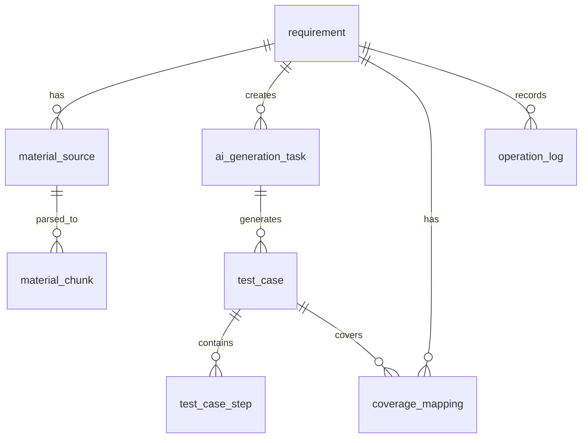

---

# 一、数据应该怎么存储？

你的平台数据可以分成 6 类。

| 数据类型    | 存什么                 | 推荐存储位置       |
| ------- | ------------------- | ------------ |
| 需求数据    | 需求标题、描述、状态、创建人      | 业务数据库        |
| 材料数据    | 上传文件、接口文档、外部来源      | 文件存储 + 数据库记录 |
| 解析数据    | 文档解析后的文本、分块、结构化内容   | 数据库 / 向量库    |
| AI 任务数据 | 生成任务、模型、状态、耗时、Token | 业务数据库        |
| 测试用例数据  | 用例标题、步骤、预期结果、优先级    | 业务数据库        |
| 分析与回流数据 | 覆盖率、风险、执行结果、缺陷关联    | 业务数据库        |

---

# 二、推荐的数据存储分层

你可以这样理解：

```text
原始数据层
  - 原始需求文本
  - 原始上传文件
  - 外部平台原始数据

解析加工层
  - 文档解析文本
  - 内容分块 Chunk
  - 结构化需求点
  - 接口信息
  - 缺陷信息

AI 生成层
  - AI 生成任务
  - Prompt 版本
  - 模型调用记录
  - 生成结果版本

业务结果层
  - 测试用例
  - 测试步骤
  - 覆盖率结果
  - 风险识别结果

执行回流层
  - 执行记录
  - 缺陷关联
  - 回流结果
  - 资产沉淀
```

---

# 三、是否需要新增数据表？

## 结论：需要。

最少也要新增下面这些表。

---

# 四、MVP 阶段最少需要的表

如果你现在只是练习或者做第一版，不要一上来设计太复杂。
第一版建议先建这 8 张表。

| 表名                   | 作用       | 是否必须 |
| -------------------- | -------- | ---- |
| `requirement`        | 需求主表     | 必须   |
| `material_source`    | 材料来源表    | 必须   |
| `material_chunk`     | 材料解析片段表  | 必须   |
| `ai_generation_task` | AI 生成任务表 | 必须   |
| `test_case`          | 测试用例主表   | 必须   |
| `test_case_step`     | 测试步骤表    | 必须   |
| `coverage_mapping`   | 覆盖关系表    | 建议   |
| `operation_log`      | 操作日志表    | 建议   |

---

# 五、核心表之间的关系

可以这样设计：



简单解释：

```text
一个需求 requirement
  可以绑定多个材料 material_source

一个材料 material_source
  可以解析成多个内容片段 material_chunk

一个需求 requirement
  可以发起多次 AI 生成任务 ai_generation_task

一次 AI 任务 ai_generation_task
  可以生成多个测试用例 test_case

一个测试用例 test_case
  可以包含多个测试步骤 test_case_step

测试用例 test_case
  可以和需求点建立覆盖关系 coverage_mapping
```

---

# 六、第一版推荐表结构

下面这套比较适合你的 AI 测试用例平台。

---

## 1. 需求主表：`requirement`

用于保存一次 AI 工作台里的需求主体。

```sql
CREATE TABLE requirement (
    id BIGINT PRIMARY KEY AUTO_INCREMENT COMMENT '需求ID',
    title VARCHAR(255) NOT NULL COMMENT '需求标题',
    description TEXT COMMENT '需求描述',
    status VARCHAR(50) NOT NULL DEFAULT 'DRAFT' COMMENT '需求状态',
    project_id BIGINT DEFAULT NULL COMMENT '所属项目ID',
    created_by BIGINT NOT NULL COMMENT '创建人ID',
    created_at DATETIME NOT NULL DEFAULT CURRENT_TIMESTAMP COMMENT '创建时间',
    updated_at DATETIME NOT NULL DEFAULT CURRENT_TIMESTAMP ON UPDATE CURRENT_TIMESTAMP COMMENT '更新时间'
) COMMENT='需求主表';
```

### 状态建议

```text
DRAFT           草稿
MATERIAL_READY  材料已准备
GENERATING      生成中
TO_CONFIRM      待确认
CONFIRMED       已确认
EXECUTING       执行中
COMPLETED       已完成
FAILED          失败
```

---

## 2. 材料来源表：`material_source`

用于保存用户上传或输入的所有材料。

包括：

* 手动输入文本
* PDF
* Word
* TXT
* Markdown
* 接口文档
* 历史缺陷
* 外部平台数据

```sql
CREATE TABLE material_source (
    id BIGINT PRIMARY KEY AUTO_INCREMENT COMMENT '材料ID',
    requirement_id BIGINT NOT NULL COMMENT '关联需求ID',
    source_type VARCHAR(50) NOT NULL COMMENT '材料来源类型',
    source_name VARCHAR(255) NOT NULL COMMENT '材料名称',
    content_type VARCHAR(50) DEFAULT NULL COMMENT '内容类型，如PDF、DOCX、TXT、TEXT、API_DOC',
    raw_content LONGTEXT COMMENT '文本类材料原始内容',
    file_url VARCHAR(500) DEFAULT NULL COMMENT '文件存储地址',
    parse_status VARCHAR(50) NOT NULL DEFAULT 'PENDING' COMMENT '解析状态',
    is_selected TINYINT NOT NULL DEFAULT 1 COMMENT '是否参与AI生成：1是，0否',
    created_by BIGINT NOT NULL COMMENT '创建人ID',
    created_at DATETIME NOT NULL DEFAULT CURRENT_TIMESTAMP COMMENT '创建时间',
    updated_at DATETIME NOT NULL DEFAULT CURRENT_TIMESTAMP ON UPDATE CURRENT_TIMESTAMP COMMENT '更新时间',
    INDEX idx_requirement_id (requirement_id)
) COMMENT='材料来源表';
```

### `source_type` 建议

```text
TEXT_INPUT      手动输入
FILE_UPLOAD     文件上传
API_DOC         接口文档
DEFECT_HISTORY  历史缺陷
KNOWLEDGE_BASE  知识库
CODE_CHANGE     代码变更
EXECUTION_LOG   执行结果
```

### 重点

文件本体不要直接存数据库。

推荐：

```text
文件本体：存 MinIO / OSS / S3 / 本地文件系统
数据库：只存 file_url、文件名、文件类型、解析状态
```

---

## 3. 材料解析片段表：`material_chunk`

用于保存文档解析后的内容分块。

AI 不应该直接吃整个 PDF，而是应该使用解析后的结构化片段。

```sql
CREATE TABLE material_chunk (
    id BIGINT PRIMARY KEY AUTO_INCREMENT COMMENT '片段ID',
    material_id BIGINT NOT NULL COMMENT '材料ID',
    requirement_id BIGINT NOT NULL COMMENT '需求ID',
    chunk_index INT NOT NULL COMMENT '片段序号',
    title VARCHAR(255) DEFAULT NULL COMMENT '片段标题',
    content LONGTEXT NOT NULL COMMENT '片段内容',
    content_type VARCHAR(50) DEFAULT NULL COMMENT '片段类型，如需求、接口、规则、缺陷',
    section_path VARCHAR(500) DEFAULT NULL COMMENT '文档章节路径',
    page_no INT DEFAULT NULL COMMENT '页码',
    token_count INT DEFAULT NULL COMMENT 'Token数量估算',
    created_at DATETIME NOT NULL DEFAULT CURRENT_TIMESTAMP COMMENT '创建时间',
    INDEX idx_material_id (material_id),
    INDEX idx_requirement_id (requirement_id)
) COMMENT='材料解析片段表';
```

### 示例数据

```json
{
  "materialId": 1001,
  "chunkIndex": 1,
  "title": "支付失败处理规则",
  "content": "当用户支付失败时，系统需要展示失败原因，并支持重新支付。",
  "contentType": "BUSINESS_RULE",
  "sectionPath": "支付流程/异常处理/支付失败",
  "pageNo": 3
}
```

---

## 4. AI 生成任务表：`ai_generation_task`

用于记录每一次 AI 生成。

为什么要有这张表？

因为一个需求可能会多次生成：

* 第一次生成
* 用户补充材料后再次生成
* 换 Prompt 后重新生成
* 换模型后重新生成
* 失败后重试生成

```sql
CREATE TABLE ai_generation_task (
    id BIGINT PRIMARY KEY AUTO_INCREMENT COMMENT 'AI任务ID',
    requirement_id BIGINT NOT NULL COMMENT '需求ID',
    task_type VARCHAR(50) NOT NULL COMMENT '任务类型',
    status VARCHAR(50) NOT NULL DEFAULT 'PENDING' COMMENT '任务状态',
    model_name VARCHAR(100) DEFAULT NULL COMMENT '模型名称',
    prompt_version VARCHAR(100) DEFAULT NULL COMMENT 'Prompt版本',
    input_summary TEXT COMMENT '输入摘要',
    output_summary TEXT COMMENT '输出摘要',
    error_message TEXT COMMENT '错误信息',
    input_token_count INT DEFAULT 0 COMMENT '输入Token数量',
    output_token_count INT DEFAULT 0 COMMENT '输出Token数量',
    cost_time_ms BIGINT DEFAULT 0 COMMENT '耗时毫秒',
    created_by BIGINT NOT NULL COMMENT '创建人ID',
    started_at DATETIME DEFAULT NULL COMMENT '开始时间',
    finished_at DATETIME DEFAULT NULL COMMENT '完成时间',
    created_at DATETIME NOT NULL DEFAULT CURRENT_TIMESTAMP COMMENT '创建时间',
    INDEX idx_requirement_id (requirement_id),
    INDEX idx_status (status)
) COMMENT='AI生成任务表';
```

### `task_type` 建议

```text
TEST_CASE_GENERATION    生成测试用例
COVERAGE_ANALYSIS       覆盖率分析
RISK_ANALYSIS           风险识别
CASE_OPTIMIZATION       用例优化
```

### `status` 建议

```text
PENDING     待执行
RUNNING     执行中
SUCCESS     成功
FAILED      失败
CANCELLED   已取消
```

---

## 5. 测试用例主表：`test_case`

用于保存 AI 生成后的测试用例。

```sql
CREATE TABLE test_case (
    id BIGINT PRIMARY KEY AUTO_INCREMENT COMMENT '测试用例ID',
    requirement_id BIGINT NOT NULL COMMENT '需求ID',
    generation_task_id BIGINT DEFAULT NULL COMMENT '生成任务ID',
    title VARCHAR(255) NOT NULL COMMENT '用例标题',
    case_type VARCHAR(50) DEFAULT NULL COMMENT '用例类型',
    priority VARCHAR(20) DEFAULT NULL COMMENT '优先级',
    precondition TEXT COMMENT '前置条件',
    expected_result TEXT COMMENT '预期结果',
    status VARCHAR(50) NOT NULL DEFAULT 'AI_GENERATED' COMMENT '用例状态',
    source_type VARCHAR(50) NOT NULL DEFAULT 'AI' COMMENT '来源类型',
    risk_tags VARCHAR(500) DEFAULT NULL COMMENT '风险标签，逗号分隔',
    coverage_tags VARCHAR(500) DEFAULT NULL COMMENT '覆盖标签，逗号分隔',
    created_by BIGINT NOT NULL COMMENT '创建人ID',
    created_at DATETIME NOT NULL DEFAULT CURRENT_TIMESTAMP COMMENT '创建时间',
    updated_at DATETIME NOT NULL DEFAULT CURRENT_TIMESTAMP ON UPDATE CURRENT_TIMESTAMP COMMENT '更新时间',
    INDEX idx_requirement_id (requirement_id),
    INDEX idx_generation_task_id (generation_task_id)
) COMMENT='测试用例主表';
```

### `status` 建议

```text
AI_GENERATED    AI生成
EDITED          人工编辑
CONFIRMED       已确认
DISCARDED       已废弃
PUSHED          已推送
EXECUTED        已执行
```

---

## 6. 测试步骤表：`test_case_step`

测试步骤建议单独拆表，不要全部塞到 `test_case.steps_json` 里。

原因是后续你可能要支持：

* 单独编辑步骤
* 调整步骤顺序
* 统计步骤数量
* 对步骤做结构化导出
* 和自动化脚本建立映射

```sql
CREATE TABLE test_case_step (
    id BIGINT PRIMARY KEY AUTO_INCREMENT COMMENT '步骤ID',
    case_id BIGINT NOT NULL COMMENT '测试用例ID',
    step_no INT NOT NULL COMMENT '步骤序号',
    action TEXT NOT NULL COMMENT '操作步骤',
    expected_result TEXT NOT NULL COMMENT '预期结果',
    created_at DATETIME NOT NULL DEFAULT CURRENT_TIMESTAMP COMMENT '创建时间',
    INDEX idx_case_id (case_id)
) COMMENT='测试用例步骤表';
```

---

## 7. 覆盖关系表：`coverage_mapping`

这张表用于记录测试用例覆盖了哪些需求点。

```sql
CREATE TABLE coverage_mapping (
    id BIGINT PRIMARY KEY AUTO_INCREMENT COMMENT '覆盖关系ID',
    requirement_id BIGINT NOT NULL COMMENT '需求ID',
    case_id BIGINT NOT NULL COMMENT '测试用例ID',
    requirement_point VARCHAR(500) NOT NULL COMMENT '需求点',
    coverage_status VARCHAR(50) NOT NULL DEFAULT 'COVERED' COMMENT '覆盖状态',
    confidence DECIMAL(5,2) DEFAULT NULL COMMENT 'AI判断置信度',
    created_at DATETIME NOT NULL DEFAULT CURRENT_TIMESTAMP COMMENT '创建时间',
    INDEX idx_requirement_id (requirement_id),
    INDEX idx_case_id (case_id)
) COMMENT='覆盖关系表';
```

### `coverage_status` 建议

```text
COVERED         已覆盖
PARTIAL         部分覆盖
MISSING         未覆盖
RISK            有风险
```

---

## 8. 操作日志表：`operation_log`

AI 平台一定要有操作日志，否则后面不好追溯。

```sql
CREATE TABLE operation_log (
    id BIGINT PRIMARY KEY AUTO_INCREMENT COMMENT '日志ID',
    requirement_id BIGINT DEFAULT NULL COMMENT '需求ID',
    operation_type VARCHAR(100) NOT NULL COMMENT '操作类型',
    operation_desc VARCHAR(500) DEFAULT NULL COMMENT '操作描述',
    operator_id BIGINT NOT NULL COMMENT '操作人ID',
    before_data JSON DEFAULT NULL COMMENT '变更前数据',
    after_data JSON DEFAULT NULL COMMENT '变更后数据',
    created_at DATETIME NOT NULL DEFAULT CURRENT_TIMESTAMP COMMENT '创建时间',
    INDEX idx_requirement_id (requirement_id),
    INDEX idx_operator_id (operator_id)
) COMMENT='操作日志表';
```

---

# 七、如果后续做完整版本，还需要这些表

MVP 不一定马上做，但技术方案里可以预留。

| 表名                     | 作用         |
| ---------------------- | ---------- |
| `requirement_point`    | 需求点表       |
| `risk_item`            | 风险项表       |
| `execution_record`     | 测试执行记录表    |
| `defect_mapping`       | 缺陷关联表      |
| `integration_config`   | 第三方平台配置表   |
| `prompt_template`      | Prompt 模板表 |
| `generation_version`   | 生成版本表      |
| `test_asset`           | 测试资产沉淀表    |
| `external_sync_record` | 第三方同步记录表   |

---

# 八、我建议你的建表优先级

## 第一阶段：先支撑页面跑通

先建：

```text
requirement
material_source
material_chunk
ai_generation_task
test_case
test_case_step
operation_log
```

这个阶段可以完成：

* 新增需求
* 上传材料
* 解析材料
* AI 生成测试用例
* 展示用例
* 编辑用例
* 保存用例

---

## 第二阶段：支撑覆盖率和风险分析

再加：

```text
requirement_point
coverage_mapping
risk_item
```

这个阶段可以完成：

* 需求点拆解
* 测试点映射
* 覆盖率统计
* 风险点识别
* 缺失场景提示

---

## 第三阶段：支撑执行和第三方集成

再加：

```text
execution_record
defect_mapping
integration_config
external_sync_record
```

这个阶段可以完成：

* 推送测试平台
* 同步执行结果
* 回收缺陷
* 沉淀测试资产

---

# 九、不要这样存

这几个设计不建议使用。

## 1. 不要把所有数据塞一张表

例如：

```text
requirement 表里面同时存：
需求描述、附件内容、解析结果、AI结果、测试用例、覆盖率、执行结果
```

这样后面会非常难维护。

---

## 2. 不要把文件二进制直接存数据库

不推荐：

```text
PDF 文件内容直接存 MySQL BLOB
```

推荐：

```text
文件存对象存储
数据库只存 file_url
```

---

## 3. 不要只保存 AI 输出文本

不推荐：

```json
{
  "aiResult": "用例1：xxx，用例2：xxx，用例3：xxx"
}
```

推荐保存成结构化数据：

```json
{
  "title": "支付失败后支持重新支付",
  "priority": "P1",
  "precondition": "用户已登录",
  "steps": [
    {
      "action": "模拟支付失败",
      "expectedResult": "展示支付失败原因"
    }
  ],
  "riskTags": ["支付链路", "异常场景"],
  "coverageTags": ["支付失败", "重新支付"]
}
```

最终落表：

```text
test_case
test_case_step
coverage_mapping
risk_item
```

---

# 十、推荐的整体存储方案

如果你现在是练习项目，可以这样选：

| 类型    | 推荐                            |
| ----- | ----------------------------- |
| 业务数据库 | MySQL 或 PostgreSQL            |
| 文件存储  | 本地文件系统 / MinIO                |
| 缓存    | 第一版可以不用，后续用 Redis             |
| 向量库   | 第一版可以不用，后续用 pgvector / Milvus |
| 日志    | 先存数据库，后续接 ELK                 |
| AI 结果 | 结构化入库，不要只存纯文本                 |

---

# 十一、最终建议

你现在最合理的方案是：

```text
需求数据：requirement
材料数据：material_source
解析内容：material_chunk
AI任务：ai_generation_task
测试用例：test_case
测试步骤：test_case_step
覆盖关系：coverage_mapping
操作记录：operation_log
```

第一版不要过度设计，先保证这条主链路跑通：

```text
创建需求
  ↓
上传/输入材料
  ↓
解析材料
  ↓
创建 AI 生成任务
  ↓
生成测试用例
  ↓
结构化保存
  ↓
前端展示和编辑
```

