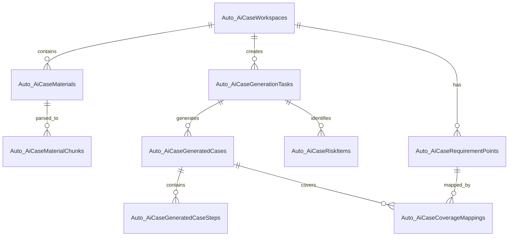

# AI 工作台数据存储方案（Auto_AiCase 命名版）

## 一、调整结论

本次数据存储方案不再使用通用表名：

```text
requirement
material_source
material_chunk
ai_generation_task
test_case
test_case_step
coverage_mapping
risk_item
```

统一调整为当前自动化测试平台已有的 `Auto_` 命名体系，并将 AI 用例生成工作台相关数据统一归入 `Auto_AiCase...` 域。

本次新增 8 张表：

| 序号 | 新增表名 | 中文名称 | 主要作用 |
| --- | --- | --- | --- |
| 1 | `Auto_AiCaseMaterials` | AI 用例材料主表 | 保存需求文本、上传文件、接口文档、历史缺陷、知识库等生成材料 |
| 2 | `Auto_AiCaseMaterialChunks` | AI 用例材料解析片段表 | 保存材料解析后的文本分块、章节、页码、内容类型等 |
| 3 | `Auto_AiCaseGenerationTasks` | AI 用例生成任务表 | 记录每一次 AI 生成、覆盖分析、风险分析任务 |
| 4 | `Auto_AiCaseGeneratedCases` | AI 生成用例草稿表 | 保存 AI 生成后的待确认测试用例 |
| 5 | `Auto_AiCaseGeneratedCaseSteps` | AI 生成用例步骤表 | 保存 AI 生成用例的操作步骤和预期结果 |
| 6 | `Auto_AiCaseRequirementPoints` | AI 需求点表 | 保存 AI 从需求和材料中拆解出的需求点 |
| 7 | `Auto_AiCaseCoverageMappings` | AI 覆盖关系表 | 保存需求点与生成用例之间的覆盖关系 |
| 8 | `Auto_AiCaseRiskItems` | AI 风险项表 | 保存 AI 识别出的业务、接口、异常、安全、性能等风险 |

其中，`Auto_AiCaseWorkspaces` 已作为 AI 工作台主表存在，不再新增 `requirement` 表。新增表统一通过 `workspace_id` 关联 `Auto_AiCaseWorkspaces.id`。

---

## 二、命名更新映射

| 原通用命名 | 新命名 | 调整说明 |
| --- | --- | --- |
| `requirement` | `Auto_AiCaseWorkspaces` | 已有工作台主表承载需求主体，不新增需求主表 |
| `material_source` | `Auto_AiCaseMaterials` | 材料统一抽象为 AI 工作台材料 |
| `material_chunk` | `Auto_AiCaseMaterialChunks` | 材料解析片段归入 AI 工作台域 |
| `ai_generation_task` | `Auto_AiCaseGenerationTasks` | 统一记录生成、覆盖分析、风险分析等 AI 任务 |
| `test_case` | `Auto_AiCaseGeneratedCases` | AI 生成结果先作为草稿，不直接进入正式用例资产表 |
| `test_case_step` | `Auto_AiCaseGeneratedCaseSteps` | 生成用例步骤单独拆表 |
| `requirement_point` | `Auto_AiCaseRequirementPoints` | 需求点拆解结果独立存储 |
| `coverage_mapping` | `Auto_AiCaseCoverageMappings` | 用例与需求点覆盖关系独立存储 |
| `risk_item` | `Auto_AiCaseRiskItems` | AI 风险识别结果独立存储 |
| `operation_log` | 复用 `Auto_TaskAuditLogs` | 操作审计已有表，不建议重复新增 |

---

## 三、核心数据关系



关系说明：

```text
一个 AI 工作台 Auto_AiCaseWorkspaces
  可以绑定多个生成材料 Auto_AiCaseMaterials

一个材料 Auto_AiCaseMaterials
  可以解析成多个内容片段 Auto_AiCaseMaterialChunks

一个工作台 Auto_AiCaseWorkspaces
  可以发起多次生成任务 Auto_AiCaseGenerationTasks

一次生成任务 Auto_AiCaseGenerationTasks
  可以生成多个用例草稿 Auto_AiCaseGeneratedCases

一个用例草稿 Auto_AiCaseGeneratedCases
  可以包含多个步骤 Auto_AiCaseGeneratedCaseSteps

一个工作台 Auto_AiCaseWorkspaces
  可以拆解出多个需求点 Auto_AiCaseRequirementPoints

一个需求点 Auto_AiCaseRequirementPoints
  可以被多个用例覆盖 Auto_AiCaseCoverageMappings

一个生成任务 Auto_AiCaseGenerationTasks
  可以识别出多个风险项 Auto_AiCaseRiskItems
```

---

## 四、新增表设计

> 说明：以下字段设计遵循当前项目已有表风格，继续使用 `Auto_` + PascalCase 表名、`int(11)` 主键、`workspace_id` 关联工作台、`created_at` / `updated_at` 时间字段。

---

### 1. `Auto_AiCaseMaterials`：AI 用例材料主表

用于保存 AI 生成依赖的材料来源，包括手动输入、上传文件、接口文档、代码变更、历史缺陷、知识库、执行结果等。

```sql
CREATE TABLE `Auto_AiCaseMaterials` (
  `id` int(11) NOT NULL AUTO_INCREMENT COMMENT '材料ID',
  `workspace_id` int(11) NOT NULL COMMENT '关联AI工作台ID',
  `material_key` varchar(64) NOT NULL COMMENT '材料稳定唯一键(UUID)',
  `node_id` varchar(64) DEFAULT NULL COMMENT '关联脑图节点ID，可为空',
  `name` varchar(255) NOT NULL COMMENT '材料名称',
  `material_type` enum('requirement','file','api_doc','defect','knowledge','code_change','execution_log','text') NOT NULL DEFAULT 'text' COMMENT '材料类型',
  `source_type` enum('manual','upload','external','repository','sync') NOT NULL DEFAULT 'manual' COMMENT '来源类型',
  `content_type` varchar(80) DEFAULT NULL COMMENT '内容类型，如PDF、DOCX、TXT、MARKDOWN、OPENAPI、TEXT',
  `raw_content` longtext DEFAULT NULL COMMENT '文本类材料原始内容',
  `storage_provider` enum('local','oss','s3','cos','minio') DEFAULT NULL COMMENT '对象存储提供方',
  `storage_bucket` varchar(120) DEFAULT NULL COMMENT '对象存储bucket',
  `storage_key` varchar(500) DEFAULT NULL COMMENT '对象存储key',
  `access_url` varchar(1000) DEFAULT NULL COMMENT '文件访问地址',
  `checksum_sha256` varchar(64) DEFAULT NULL COMMENT '文件SHA256',
  `parse_status` enum('pending','parsing','parsed','failed','skipped') NOT NULL DEFAULT 'pending' COMMENT '解析状态',
  `parse_error` text DEFAULT NULL COMMENT '解析失败原因',
  `is_selected` tinyint(1) NOT NULL DEFAULT 1 COMMENT '是否参与AI生成：1是，0否',
  `created_by` int(11) DEFAULT NULL COMMENT '创建人ID',
  `updated_by` int(11) DEFAULT NULL COMMENT '更新人ID',
  `created_at` datetime NOT NULL DEFAULT current_timestamp() COMMENT '创建时间',
  `updated_at` datetime NOT NULL DEFAULT current_timestamp() ON UPDATE current_timestamp() COMMENT '更新时间',
  `is_deleted` tinyint(1) NOT NULL DEFAULT 0 COMMENT '软删除标记',
  PRIMARY KEY (`id`),
  UNIQUE KEY `uniq_ai_material_key` (`material_key`),
  KEY `idx_ai_material_workspace` (`workspace_id`),
  KEY `idx_ai_material_node` (`workspace_id`,`node_id`),
  KEY `idx_ai_material_type` (`material_type`),
  KEY `idx_ai_material_parse_status` (`parse_status`),
  KEY `idx_ai_material_selected` (`workspace_id`,`is_selected`),
  CONSTRAINT `fk_ai_material_workspace` FOREIGN KEY (`workspace_id`) REFERENCES `Auto_AiCaseWorkspaces` (`id`) ON DELETE CASCADE,
  CONSTRAINT `fk_ai_material_created_by` FOREIGN KEY (`created_by`) REFERENCES `Auto_Users` (`id`) ON DELETE SET NULL,
  CONSTRAINT `fk_ai_material_updated_by` FOREIGN KEY (`updated_by`) REFERENCES `Auto_Users` (`id`) ON DELETE SET NULL
) ENGINE=InnoDB DEFAULT CHARSET=utf8mb4 COLLATE=utf8mb4_unicode_ci COMMENT='AI 用例材料主表';
```

---

### 2. `Auto_AiCaseMaterialChunks`：AI 用例材料解析片段表

用于保存材料解析后的分块内容。AI 生成时不直接读取完整文件，而是读取解析后的结构化片段。

```sql
CREATE TABLE `Auto_AiCaseMaterialChunks` (
  `id` int(11) NOT NULL AUTO_INCREMENT COMMENT '材料片段ID',
  `workspace_id` int(11) NOT NULL COMMENT '关联AI工作台ID',
  `material_id` int(11) NOT NULL COMMENT '关联材料ID',
  `chunk_index` int(11) NOT NULL COMMENT '片段序号',
  `title` varchar(255) DEFAULT NULL COMMENT '片段标题',
  `content` longtext NOT NULL COMMENT '片段内容',
  `content_type` enum('requirement','business_rule','api','defect','knowledge','code','execution','other') DEFAULT 'other' COMMENT '片段内容类型',
  `section_path` varchar(500) DEFAULT NULL COMMENT '章节路径',
  `page_no` int(11) DEFAULT NULL COMMENT '页码',
  `token_count` int(11) DEFAULT 0 COMMENT 'Token数量估算',
  `vector_ref` varchar(128) DEFAULT NULL COMMENT '向量索引引用ID，可为空',
  `meta_json` longtext CHARACTER SET utf8mb4 COLLATE utf8mb4_bin DEFAULT NULL COMMENT '扩展元数据JSON' CHECK (`meta_json` IS NULL OR json_valid(`meta_json`)),
  `created_at` datetime NOT NULL DEFAULT current_timestamp() COMMENT '创建时间',
  PRIMARY KEY (`id`),
  KEY `idx_ai_chunk_workspace` (`workspace_id`),
  KEY `idx_ai_chunk_material` (`material_id`),
  KEY `idx_ai_chunk_material_index` (`material_id`,`chunk_index`),
  KEY `idx_ai_chunk_content_type` (`content_type`),
  CONSTRAINT `fk_ai_chunk_workspace` FOREIGN KEY (`workspace_id`) REFERENCES `Auto_AiCaseWorkspaces` (`id`) ON DELETE CASCADE,
  CONSTRAINT `fk_ai_chunk_material` FOREIGN KEY (`material_id`) REFERENCES `Auto_AiCaseMaterials` (`id`) ON DELETE CASCADE
) ENGINE=InnoDB DEFAULT CHARSET=utf8mb4 COLLATE=utf8mb4_unicode_ci COMMENT='AI 用例材料解析片段表';
```

---

### 3. `Auto_AiCaseGenerationTasks`：AI 用例生成任务表

用于记录每一次 AI 任务，包括生成测试用例、覆盖率分析、风险识别、用例优化等。

```sql
CREATE TABLE `Auto_AiCaseGenerationTasks` (
  `id` int(11) NOT NULL AUTO_INCREMENT COMMENT 'AI生成任务ID',
  `workspace_id` int(11) NOT NULL COMMENT '关联AI工作台ID',
  `task_key` varchar(64) NOT NULL COMMENT '任务稳定唯一键(UUID)',
  `task_type` enum('case_generation','coverage_analysis','risk_analysis','case_optimization') NOT NULL DEFAULT 'case_generation' COMMENT '任务类型',
  `status` enum('pending','running','success','failed','cancelled') NOT NULL DEFAULT 'pending' COMMENT '任务状态',
  `model_name` varchar(100) DEFAULT NULL COMMENT '模型名称',
  `prompt_version` varchar(100) DEFAULT NULL COMMENT 'Prompt版本',
  `input_summary` text DEFAULT NULL COMMENT '输入摘要',
  `output_summary` text DEFAULT NULL COMMENT '输出摘要',
  `error_message` text DEFAULT NULL COMMENT '错误信息',
  `input_token_count` int(11) NOT NULL DEFAULT 0 COMMENT '输入Token数量',
  `output_token_count` int(11) NOT NULL DEFAULT 0 COMMENT '输出Token数量',
  `cost_time_ms` int(11) NOT NULL DEFAULT 0 COMMENT '耗时毫秒',
  `created_by` int(11) DEFAULT NULL COMMENT '创建人ID',
  `started_at` datetime DEFAULT NULL COMMENT '开始时间',
  `finished_at` datetime DEFAULT NULL COMMENT '完成时间',
  `created_at` datetime NOT NULL DEFAULT current_timestamp() COMMENT '创建时间',
  `updated_at` datetime NOT NULL DEFAULT current_timestamp() ON UPDATE current_timestamp() COMMENT '更新时间',
  PRIMARY KEY (`id`),
  UNIQUE KEY `uniq_ai_generation_task_key` (`task_key`),
  KEY `idx_ai_generation_workspace` (`workspace_id`),
  KEY `idx_ai_generation_status` (`status`),
  KEY `idx_ai_generation_type` (`task_type`),
  KEY `idx_ai_generation_created_by` (`created_by`),
  CONSTRAINT `fk_ai_generation_workspace` FOREIGN KEY (`workspace_id`) REFERENCES `Auto_AiCaseWorkspaces` (`id`) ON DELETE CASCADE,
  CONSTRAINT `fk_ai_generation_created_by` FOREIGN KEY (`created_by`) REFERENCES `Auto_Users` (`id`) ON DELETE SET NULL
) ENGINE=InnoDB DEFAULT CHARSET=utf8mb4 COLLATE=utf8mb4_unicode_ci COMMENT='AI 用例生成任务表';
```

---

### 4. `Auto_AiCaseGeneratedCases`：AI 生成用例草稿表

用于保存 AI 生成后的用例草稿。用户确认前不直接进入正式 `Auto_TestCase`，避免 AI 临时结果污染正式测试资产。

```sql
CREATE TABLE `Auto_AiCaseGeneratedCases` (
  `id` int(11) NOT NULL AUTO_INCREMENT COMMENT 'AI生成用例ID',
  `workspace_id` int(11) NOT NULL COMMENT '关联AI工作台ID',
  `generation_task_id` int(11) DEFAULT NULL COMMENT '关联AI生成任务ID',
  `case_key` varchar(100) DEFAULT NULL COMMENT '生成用例稳定键',
  `node_id` varchar(64) DEFAULT NULL COMMENT '关联脑图节点ID，可为空',
  `name` varchar(255) NOT NULL COMMENT '用例标题',
  `description` text DEFAULT NULL COMMENT '用例描述',
  `module` varchar(100) DEFAULT NULL COMMENT '所属功能模块',
  `priority` enum('P0','P1','P2','P3') DEFAULT 'P1' COMMENT '优先级',
  `case_type` enum('functional','api','ui','integration','security','performance','compatibility','other') DEFAULT 'functional' COMMENT '用例类型',
  `precondition` text DEFAULT NULL COMMENT '前置条件',
  `expected_result` text DEFAULT NULL COMMENT '整体预期结果',
  `status` enum('ai_generated','edited','confirmed','discarded','published') NOT NULL DEFAULT 'ai_generated' COMMENT '用例状态',
  `source` enum('ai','manual') NOT NULL DEFAULT 'ai' COMMENT '来源',
  `coverage_tags` longtext CHARACTER SET utf8mb4 COLLATE utf8mb4_bin DEFAULT NULL COMMENT '覆盖标签JSON数组' CHECK (`coverage_tags` IS NULL OR json_valid(`coverage_tags`)),
  `risk_tags` longtext CHARACTER SET utf8mb4 COLLATE utf8mb4_bin DEFAULT NULL COMMENT '风险标签JSON数组' CHECK (`risk_tags` IS NULL OR json_valid(`risk_tags`)),
  `published_case_id` int(11) DEFAULT NULL COMMENT '确认后关联的正式Auto_TestCase ID',
  `sort_order` int(11) NOT NULL DEFAULT 0 COMMENT '排序号',
  `created_by` int(11) DEFAULT NULL COMMENT '创建人ID',
  `updated_by` int(11) DEFAULT NULL COMMENT '更新人ID',
  `created_at` datetime NOT NULL DEFAULT current_timestamp() COMMENT '创建时间',
  `updated_at` datetime NOT NULL DEFAULT current_timestamp() ON UPDATE current_timestamp() COMMENT '更新时间',
  `is_deleted` tinyint(1) NOT NULL DEFAULT 0 COMMENT '软删除标记',
  PRIMARY KEY (`id`),
  KEY `idx_ai_case_workspace` (`workspace_id`),
  KEY `idx_ai_case_task` (`generation_task_id`),
  KEY `idx_ai_case_node` (`workspace_id`,`node_id`),
  KEY `idx_ai_case_status` (`status`),
  KEY `idx_ai_case_published` (`published_case_id`),
  CONSTRAINT `fk_ai_case_workspace` FOREIGN KEY (`workspace_id`) REFERENCES `Auto_AiCaseWorkspaces` (`id`) ON DELETE CASCADE,
  CONSTRAINT `fk_ai_case_generation_task` FOREIGN KEY (`generation_task_id`) REFERENCES `Auto_AiCaseGenerationTasks` (`id`) ON DELETE SET NULL,
  CONSTRAINT `fk_ai_case_published_case` FOREIGN KEY (`published_case_id`) REFERENCES `Auto_TestCase` (`id`) ON DELETE SET NULL,
  CONSTRAINT `fk_ai_case_created_by` FOREIGN KEY (`created_by`) REFERENCES `Auto_Users` (`id`) ON DELETE SET NULL,
  CONSTRAINT `fk_ai_case_updated_by` FOREIGN KEY (`updated_by`) REFERENCES `Auto_Users` (`id`) ON DELETE SET NULL
) ENGINE=InnoDB DEFAULT CHARSET=utf8mb4 COLLATE=utf8mb4_unicode_ci COMMENT='AI 生成用例草稿表';
```

---

### 5. `Auto_AiCaseGeneratedCaseSteps`：AI 生成用例步骤表

用于保存生成用例的步骤。步骤单独拆表，方便编辑、排序、导出和后续映射自动化脚本。

```sql
CREATE TABLE `Auto_AiCaseGeneratedCaseSteps` (
  `id` int(11) NOT NULL AUTO_INCREMENT COMMENT 'AI生成用例步骤ID',
  `generated_case_id` int(11) NOT NULL COMMENT '关联AI生成用例ID',
  `step_no` int(11) NOT NULL COMMENT '步骤序号',
  `action` text NOT NULL COMMENT '操作步骤',
  `expected_result` text NOT NULL COMMENT '预期结果',
  `test_data` text DEFAULT NULL COMMENT '测试数据',
  `created_at` datetime NOT NULL DEFAULT current_timestamp() COMMENT '创建时间',
  `updated_at` datetime NOT NULL DEFAULT current_timestamp() ON UPDATE current_timestamp() COMMENT '更新时间',
  PRIMARY KEY (`id`),
  KEY `idx_ai_case_step_case` (`generated_case_id`),
  KEY `idx_ai_case_step_no` (`generated_case_id`,`step_no`),
  CONSTRAINT `fk_ai_case_step_case` FOREIGN KEY (`generated_case_id`) REFERENCES `Auto_AiCaseGeneratedCases` (`id`) ON DELETE CASCADE
) ENGINE=InnoDB DEFAULT CHARSET=utf8mb4 COLLATE=utf8mb4_unicode_ci COMMENT='AI 生成用例步骤表';
```

---

### 6. `Auto_AiCaseRequirementPoints`：AI 需求点表

用于保存 AI 从需求描述、PRD、接口文档、知识库等材料中拆解出来的需求点。

```sql
CREATE TABLE `Auto_AiCaseRequirementPoints` (
  `id` int(11) NOT NULL AUTO_INCREMENT COMMENT '需求点ID',
  `workspace_id` int(11) NOT NULL COMMENT '关联AI工作台ID',
  `generation_task_id` int(11) DEFAULT NULL COMMENT '来源AI任务ID',
  `point_key` varchar(100) DEFAULT NULL COMMENT '需求点稳定键',
  `title` varchar(255) NOT NULL COMMENT '需求点标题',
  `description` text DEFAULT NULL COMMENT '需求点描述',
  `source_material_id` int(11) DEFAULT NULL COMMENT '来源材料ID',
  `source_chunk_id` int(11) DEFAULT NULL COMMENT '来源材料片段ID',
  `priority` enum('P0','P1','P2','P3') DEFAULT 'P1' COMMENT '需求点优先级',
  `risk_level` enum('low','medium','high','critical') DEFAULT 'medium' COMMENT '风险等级',
  `status` enum('active','ignored') NOT NULL DEFAULT 'active' COMMENT '状态',
  `sort_order` int(11) NOT NULL DEFAULT 0 COMMENT '排序号',
  `created_at` datetime NOT NULL DEFAULT current_timestamp() COMMENT '创建时间',
  `updated_at` datetime NOT NULL DEFAULT current_timestamp() ON UPDATE current_timestamp() COMMENT '更新时间',
  PRIMARY KEY (`id`),
  KEY `idx_ai_req_point_workspace` (`workspace_id`),
  KEY `idx_ai_req_point_task` (`generation_task_id`),
  KEY `idx_ai_req_point_material` (`source_material_id`),
  KEY `idx_ai_req_point_chunk` (`source_chunk_id`),
  KEY `idx_ai_req_point_status` (`status`),
  CONSTRAINT `fk_ai_req_point_workspace` FOREIGN KEY (`workspace_id`) REFERENCES `Auto_AiCaseWorkspaces` (`id`) ON DELETE CASCADE,
  CONSTRAINT `fk_ai_req_point_task` FOREIGN KEY (`generation_task_id`) REFERENCES `Auto_AiCaseGenerationTasks` (`id`) ON DELETE SET NULL,
  CONSTRAINT `fk_ai_req_point_material` FOREIGN KEY (`source_material_id`) REFERENCES `Auto_AiCaseMaterials` (`id`) ON DELETE SET NULL,
  CONSTRAINT `fk_ai_req_point_chunk` FOREIGN KEY (`source_chunk_id`) REFERENCES `Auto_AiCaseMaterialChunks` (`id`) ON DELETE SET NULL
) ENGINE=InnoDB DEFAULT CHARSET=utf8mb4 COLLATE=utf8mb4_unicode_ci COMMENT='AI 需求点表';
```

---

### 7. `Auto_AiCaseCoverageMappings`：AI 覆盖关系表

用于保存需求点与 AI 生成用例之间的覆盖关系，支持覆盖率统计、缺失场景识别和风险提示。

```sql
CREATE TABLE `Auto_AiCaseCoverageMappings` (
  `id` int(11) NOT NULL AUTO_INCREMENT COMMENT '覆盖关系ID',
  `workspace_id` int(11) NOT NULL COMMENT '关联AI工作台ID',
  `generation_task_id` int(11) DEFAULT NULL COMMENT '来源AI任务ID',
  `requirement_point_id` int(11) NOT NULL COMMENT '需求点ID',
  `generated_case_id` int(11) DEFAULT NULL COMMENT 'AI生成用例ID，未覆盖时可为空',
  `coverage_status` enum('covered','partial','missing','risk') NOT NULL DEFAULT 'covered' COMMENT '覆盖状态',
  `confidence` decimal(5,2) DEFAULT NULL COMMENT 'AI判断置信度，0-100',
  `evidence` text DEFAULT NULL COMMENT '覆盖依据说明',
  `created_at` datetime NOT NULL DEFAULT current_timestamp() COMMENT '创建时间',
  PRIMARY KEY (`id`),
  KEY `idx_ai_coverage_workspace` (`workspace_id`),
  KEY `idx_ai_coverage_task` (`generation_task_id`),
  KEY `idx_ai_coverage_point` (`requirement_point_id`),
  KEY `idx_ai_coverage_case` (`generated_case_id`),
  KEY `idx_ai_coverage_status` (`coverage_status`),
  CONSTRAINT `fk_ai_coverage_workspace` FOREIGN KEY (`workspace_id`) REFERENCES `Auto_AiCaseWorkspaces` (`id`) ON DELETE CASCADE,
  CONSTRAINT `fk_ai_coverage_task` FOREIGN KEY (`generation_task_id`) REFERENCES `Auto_AiCaseGenerationTasks` (`id`) ON DELETE SET NULL,
  CONSTRAINT `fk_ai_coverage_point` FOREIGN KEY (`requirement_point_id`) REFERENCES `Auto_AiCaseRequirementPoints` (`id`) ON DELETE CASCADE,
  CONSTRAINT `fk_ai_coverage_case` FOREIGN KEY (`generated_case_id`) REFERENCES `Auto_AiCaseGeneratedCases` (`id`) ON DELETE SET NULL
) ENGINE=InnoDB DEFAULT CHARSET=utf8mb4 COLLATE=utf8mb4_unicode_ci COMMENT='AI 覆盖关系表';
```

---

### 8. `Auto_AiCaseRiskItems`：AI 风险项表

用于保存 AI 根据需求、接口、缺陷、代码变更和执行结果识别出来的风险项。

```sql
CREATE TABLE `Auto_AiCaseRiskItems` (
  `id` int(11) NOT NULL AUTO_INCREMENT COMMENT '风险项ID',
  `workspace_id` int(11) NOT NULL COMMENT '关联AI工作台ID',
  `generation_task_id` int(11) DEFAULT NULL COMMENT '来源AI任务ID',
  `requirement_point_id` int(11) DEFAULT NULL COMMENT '关联需求点ID',
  `generated_case_id` int(11) DEFAULT NULL COMMENT '关联AI生成用例ID',
  `risk_title` varchar(255) NOT NULL COMMENT '风险标题',
  `risk_desc` text DEFAULT NULL COMMENT '风险描述',
  `risk_type` enum('business','data','interface','security','performance','compatibility','exception','other') DEFAULT 'business' COMMENT '风险类型',
  `risk_level` enum('low','medium','high','critical') DEFAULT 'medium' COMMENT '风险等级',
  `suggestion` text DEFAULT NULL COMMENT '处理建议',
  `status` enum('open','accepted','ignored','resolved') NOT NULL DEFAULT 'open' COMMENT '风险状态',
  `created_at` datetime NOT NULL DEFAULT current_timestamp() COMMENT '创建时间',
  `updated_at` datetime NOT NULL DEFAULT current_timestamp() ON UPDATE current_timestamp() COMMENT '更新时间',
  PRIMARY KEY (`id`),
  KEY `idx_ai_risk_workspace` (`workspace_id`),
  KEY `idx_ai_risk_task` (`generation_task_id`),
  KEY `idx_ai_risk_point` (`requirement_point_id`),
  KEY `idx_ai_risk_case` (`generated_case_id`),
  KEY `idx_ai_risk_level` (`risk_level`),
  KEY `idx_ai_risk_status` (`status`),
  CONSTRAINT `fk_ai_risk_workspace` FOREIGN KEY (`workspace_id`) REFERENCES `Auto_AiCaseWorkspaces` (`id`) ON DELETE CASCADE,
  CONSTRAINT `fk_ai_risk_task` FOREIGN KEY (`generation_task_id`) REFERENCES `Auto_AiCaseGenerationTasks` (`id`) ON DELETE SET NULL,
  CONSTRAINT `fk_ai_risk_point` FOREIGN KEY (`requirement_point_id`) REFERENCES `Auto_AiCaseRequirementPoints` (`id`) ON DELETE SET NULL,
  CONSTRAINT `fk_ai_risk_case` FOREIGN KEY (`generated_case_id`) REFERENCES `Auto_AiCaseGeneratedCases` (`id`) ON DELETE SET NULL
) ENGINE=InnoDB DEFAULT CHARSET=utf8mb4 COLLATE=utf8mb4_unicode_ci COMMENT='AI 风险项表';
```

---

## 五、更新后的数据存储分层

| 数据层 | 对应表 | 说明 |
| --- | --- | --- |
| 工作台主数据层 | `Auto_AiCaseWorkspaces` | 保存工作台、需求描述、脑图快照、工作台状态和统计信息 |
| 材料接入层 | `Auto_AiCaseMaterials` | 保存文本、文件、接口文档、知识库、缺陷等材料元信息 |
| 解析加工层 | `Auto_AiCaseMaterialChunks` | 保存材料解析后的分块内容，供 AI 上下文组装使用 |
| AI 任务层 | `Auto_AiCaseGenerationTasks` | 保存 AI 生成、覆盖分析、风险分析等任务记录 |
| 需求点层 | `Auto_AiCaseRequirementPoints` | 保存 AI 拆解出的需求点，作为覆盖率分析基础 |
| 生成草稿层 | `Auto_AiCaseGeneratedCases`、`Auto_AiCaseGeneratedCaseSteps` | 保存 AI 生成用例草稿和步骤，等待人工确认 |
| 分析结果层 | `Auto_AiCaseCoverageMappings`、`Auto_AiCaseRiskItems` | 保存覆盖关系和风险识别结果 |
| 正式资产层 | `Auto_TestCase` | 用户确认后再发布到正式测试用例资产表 |
| 审计日志层 | `Auto_TaskAuditLogs` | 复用已有任务审计日志表记录关键操作 |

---

## 六、更新后的主链路

```text
创建 AI 工作台
  ↓
Auto_AiCaseWorkspaces 保存需求主体和脑图快照
  ↓
上传 / 输入 / 接入材料
  ↓
Auto_AiCaseMaterials 保存材料元信息
  ↓
解析材料
  ↓
Auto_AiCaseMaterialChunks 保存材料片段
  ↓
创建 AI 生成任务
  ↓
Auto_AiCaseGenerationTasks 记录任务状态
  ↓
拆解需求点
  ↓
Auto_AiCaseRequirementPoints 保存需求点
  ↓
生成测试用例草稿
  ↓
Auto_AiCaseGeneratedCases + Auto_AiCaseGeneratedCaseSteps 保存生成结果
  ↓
计算覆盖关系和风险项
  ↓
Auto_AiCaseCoverageMappings + Auto_AiCaseRiskItems 保存分析结果
  ↓
用户确认 / 编辑 / 废弃
  ↓
确认后的用例发布到 Auto_TestCase
```

---

## 七、更新后的建表计划

### 第一阶段：材料接入与 AI 生成主链路

优先新增：

```text
Auto_AiCaseMaterials
Auto_AiCaseMaterialChunks
Auto_AiCaseGenerationTasks
Auto_AiCaseGeneratedCases
Auto_AiCaseGeneratedCaseSteps
```

该阶段目标：

- 支持工作台绑定材料
- 支持文本、文件、接口文档等材料统一存储
- 支持材料解析和分块存储
- 支持创建 AI 生成任务
- 支持 AI 生成用例草稿
- 支持用例步骤结构化保存
- 支持前端展示、编辑、筛选、确认生成结果

该阶段不强依赖覆盖率和风险分析，可以先让“材料 → 生成 → 草稿用例 → 人工确认”的核心链路跑通。

---

### 第二阶段：需求点、覆盖率与风险分析

继续新增：

```text
Auto_AiCaseRequirementPoints
Auto_AiCaseCoverageMappings
Auto_AiCaseRiskItems
```

该阶段目标：

- 支持从材料中拆解需求点
- 支持生成用例与需求点建立映射关系
- 支持识别未覆盖、部分覆盖、风险覆盖场景
- 支持展示覆盖率分析结果
- 支持展示风险项和补充建议

---

### 第三阶段：确认发布与正式资产沉淀

该阶段不一定需要新增表，优先复用已有表：

```text
Auto_TestCase
Auto_TestCaseTasks
Auto_TestCaseTaskExecutions
Auto_TestRun
Auto_TestRunResults
Auto_TaskAuditLogs
```

该阶段目标：

- AI 生成用例确认后发布为正式 `Auto_TestCase`
- 后续可绑定自动化脚本、仓库配置、测试任务和执行结果
- 执行结果回流后可反向补充风险识别和后续生成上下文
- 关键操作记录到 `Auto_TaskAuditLogs`

---

## 八、存储边界说明

### 1. 为什么不新增 `Auto_AiCaseRequirements`

当前已有 `Auto_AiCaseWorkspaces`，其中已经包含：

```text
workspace_key
name
project_id
requirement_text
map_data
status
version
created_by
updated_by
created_at
updated_at
```

它已经可以承载 AI 工作台需求主体，因此不建议再新增 `Auto_AiCaseRequirements`，避免需求主数据重复。

---

### 2. 为什么 AI 生成用例不直接写入 `Auto_TestCase`

AI 生成结果存在临时性和不确定性，用户通常还需要筛选、修改、补充、废弃。直接写入正式 `Auto_TestCase` 会污染正式用例资产。

推荐做法：

```text
AI 生成结果
  ↓
Auto_AiCaseGeneratedCases 草稿区
  ↓ 人工确认
Auto_TestCase 正式资产区
```

---

### 3. 为什么材料文件不直接存数据库

文件本体不建议存入数据库 BLOB。推荐：

```text
文件本体：对象存储 / 本地文件系统 / MinIO / OSS / S3
数据库：保存 storage_provider、storage_bucket、storage_key、access_url、checksum_sha256
```

这样可以减少数据库压力，也方便后续文件预览、下载、权限控制和迁移。

---

### 4. 为什么材料解析片段需要单独拆表

AI 生成不应该直接消费完整 PDF、Word 或接口文档，而应该消费清洗后的片段。`Auto_AiCaseMaterialChunks` 可以支持：

- 按章节召回
- 按页码追溯
- 按内容类型筛选
- 按 token 数控制上下文长度
- 后续接入向量检索
- 定位生成结果来源依据

---

## 九、最终建议

本次数据存储方案建议从原来的通用表名体系，统一调整为 `Auto_AiCase...` 命名体系。

最终新增 8 张表：

```text
Auto_AiCaseMaterials
Auto_AiCaseMaterialChunks
Auto_AiCaseGenerationTasks
Auto_AiCaseGeneratedCases
Auto_AiCaseGeneratedCaseSteps
Auto_AiCaseRequirementPoints
Auto_AiCaseCoverageMappings
Auto_AiCaseRiskItems
```

其中：

- `Auto_AiCaseWorkspaces` 继续作为 AI 工作台主表
- `Auto_AiCaseMaterials` 和 `Auto_AiCaseMaterialChunks` 承载材料接入和解析结果
- `Auto_AiCaseGenerationTasks` 承载 AI 任务状态和调用结果
- `Auto_AiCaseGeneratedCases` 和 `Auto_AiCaseGeneratedCaseSteps` 承载生成用例草稿
- `Auto_AiCaseRequirementPoints`、`Auto_AiCaseCoverageMappings`、`Auto_AiCaseRiskItems` 承载覆盖率和风险分析
- 用户确认后的测试用例再发布到正式 `Auto_TestCase`
- 操作审计优先复用 `Auto_TaskAuditLogs`
