# Automation Platform 系统架构文档

本文档使用 Mermaid 图表展示 Automation Platform 的完整系统架构。

---

## 目录

1. [系统总体架构](#1-系统总体架构)
2. [前端组件架构](#2-前端组件架构)
3. [后端服务架构](#3-后端服务架构)
4. [数据库设计](#4-数据库设计)
5. [部署架构](#5-部署架构)
6. [核心流程](#6-核心流程)

---

## 1. 系统总体架构

### 1.1 宏观架构视图

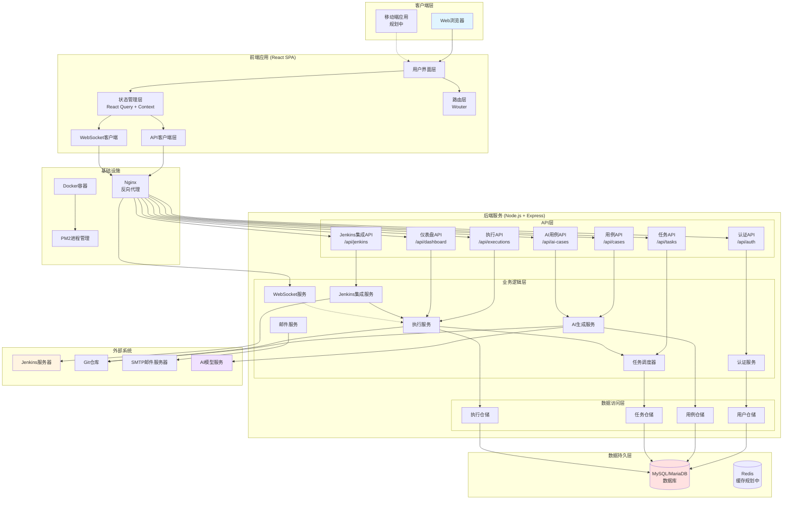
```mermaid
graph TB
    subgraph "客户端层"
        Browser[Web浏览器]
        MobileApp[移动端应用<br/>规划中]
    end

    subgraph "前端应用 (React SPA)"
        UI[用户界面层]
        State[状态管理层<br/>React Query + Context]
        Router[路由层<br/>Wouter]
        API[API客户端层]
        WS_Client[WebSocket客户端]
    end

    subgraph "后端服务 (Node.js + Express)"
        subgraph "API层"
            Auth_API[认证API<br/>/api/auth]
            Cases_API[用例API<br/>/api/cases]
            Tasks_API[任务API<br/>/api/tasks]
            Exec_API[执行API<br/>/api/executions]
            Dashboard_API[仪表盘API<br/>/api/dashboard]
            Jenkins_API[Jenkins集成API<br/>/api/jenkins]
            AI_API[AI用例API<br/>/api/ai-cases]
        end

        subgraph "业务逻辑层"
            Auth_Svc[认证服务]
            Execution_Svc[执行服务]
            Task_Scheduler[任务调度器]
            AI_Svc[AI生成服务]
            Jenkins_Svc[Jenkins集成服务]
            Email_Svc[邮件服务]
            WebSocket_Svc[WebSocket服务]
        end

        subgraph "数据访问层"
            User_Repo[用户仓储]
            Case_Repo[用例仓储]
            Task_Repo[任务仓储]
            Execution_Repo[执行仓储]
        end
    end

    subgraph "数据持久层"
        MySQL[(MySQL/MariaDB<br/>数据库)]
        Redis[(Redis<br/>缓存规划中)]
    end

    subgraph "外部系统"
        Jenkins_Server[Jenkins服务器]
        Git_Repo[Git仓库]
        SMTP_Server[SMTP邮件服务器]
        AI_Model[AI模型服务]
    end

    subgraph "基础设施"
        Nginx[Nginx<br/>反向代理]
        Docker[Docker容器]
        PM2[PM2进程管理]
    end

    %% 客户端连接
    Browser --> UI
    MobileApp -.-> UI

    %% 前端内部连接
    UI --> State
    UI --> Router
    State --> API
    State --> WS_Client
    API --> Nginx
    WS_Client --> Nginx

    %% Nginx到后端
    Nginx --> Auth_API
    Nginx --> Cases_API
    Nginx --> Tasks_API
    Nginx --> Exec_API
    Nginx --> Dashboard_API
    Nginx --> Jenkins_API
    Nginx --> AI_API
    Nginx --> WebSocket_Svc

    %% API到服务层
    Auth_API --> Auth_Svc
    Cases_API --> AI_Svc
    Tasks_API --> Task_Scheduler
    Exec_API --> Execution_Svc
    Dashboard_API --> Execution_Svc
    Jenkins_API --> Jenkins_Svc
    AI_API --> AI_Svc

    %% 服务层连接
    Auth_Svc --> User_Repo
    Execution_Svc --> Execution_Repo
    Execution_Svc --> Task_Scheduler
    Task_Scheduler --> Task_Repo
    AI_Svc --> Case_Repo
    Jenkins_Svc --> Execution_Svc
    Email_Svc --> SMTP_Server
    WebSocket_Svc -.-> Execution_Svc

    %% 数据访问层到数据库
    User_Repo --> MySQL
    Case_Repo --> MySQL
    Task_Repo --> MySQL
    Execution_Repo --> MySQL

    %% 外部系统集成
    Jenkins_Svc --> Jenkins_Server
    AI_Svc --> AI_Model
    AI_Svc --> Git_Repo
    Execution_Svc --> Git_Repo

    %% 基础设施
    Docker --> PM2

    style Browser fill:#e1f5ff
    style MySQL fill:#ffe1e1
    style Jenkins_Server fill:#fff4e1
    style AI_Model fill:#f0e1ff
```

### 1.2 技术栈总览

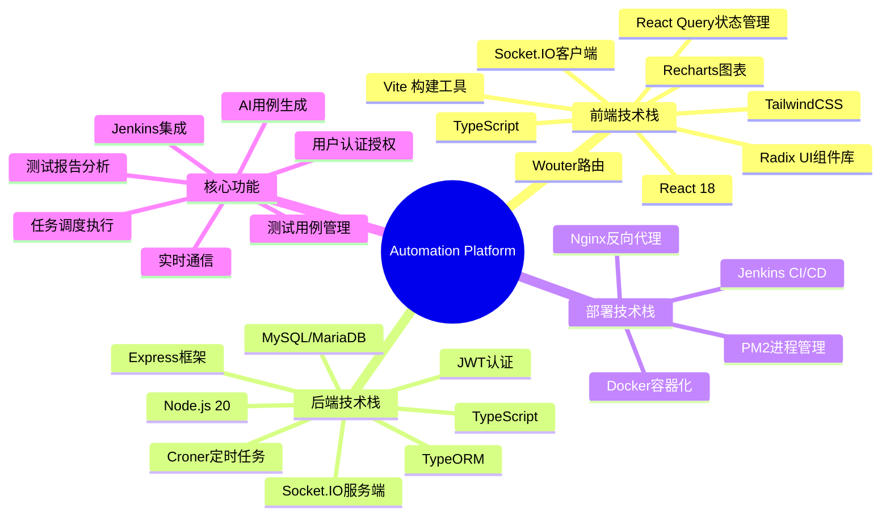
```mermaid
mindmap
  root((Automation Platform))
    前端技术栈
      React 18
      TypeScript
      Vite 构建工具
      TailwindCSS
      Radix UI组件库
      React Query状态管理
      Wouter路由
      Socket.IO客户端
      Recharts图表
    后端技术栈
      Node.js 20
      Express框架
      TypeScript
      TypeORM
      MySQL/MariaDB
      Socket.IO服务端
      JWT认证
      Croner定时任务
    部署技术栈
      Docker容器化
      Jenkins CI/CD
      PM2进程管理
      Nginx反向代理
    核心功能
      用户认证授权
      测试用例管理
      任务调度执行
      测试报告分析
      AI用例生成
      Jenkins集成
      实时通信
```

---

## 2. 前端组件架构

### 2.1 组件层次结构

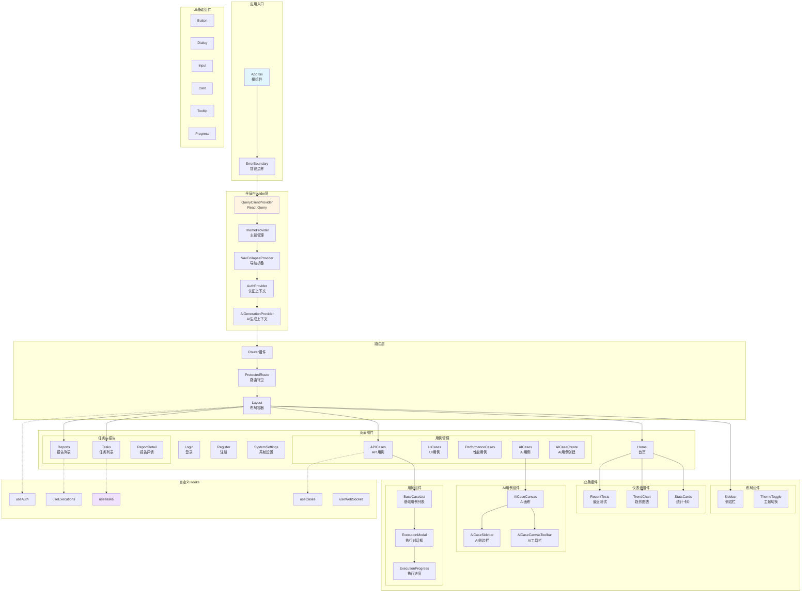
```mermaid
graph TB
    subgraph "应用入口"
        App[App.tsx<br/>根组件]
        ErrorBoundary[ErrorBoundary<br/>错误边界]
    end

    subgraph "全局Provider层"
        QueryProvider[QueryClientProvider<br/>React Query]
        ThemeProvider[ThemeProvider<br/>主题管理]
        AuthProvider[AuthProvider<br/>认证上下文]
        AiProvider[AiGenerationProvider<br/>AI生成上下文]
        NavProvider[NavCollapseProvider<br/>导航折叠]
    end

    subgraph "路由层"
        Router[Router组件]
        ProtectedRoute[ProtectedRoute<br/>路由守卫]
        Layout[Layout<br/>布局容器]
    end

    subgraph "页面组件"
        Home[Home<br/>首页]
        Login[Login<br/>登录]
        Register[Register<br/>注册]
        
        subgraph "用例管理"
            APICases[APICases<br/>API用例]
            UICases[UICases<br/>UI用例]
            PerformanceCases[PerformanceCases<br/>性能用例]
            AICases[AICases<br/>AI用例]
            AICaseCreate[AICaseCreate<br/>AI用例创建]
        end

        subgraph "任务与报告"
            Tasks[Tasks<br/>任务列表]
            Reports[Reports<br/>报告列表]
            ReportDetail[ReportDetail<br/>报告详情]
        end

        Settings[SystemSettings<br/>系统设置]
    end

    subgraph "业务组件"
        subgraph "布局组件"
            Sidebar[Sidebar<br/>侧边栏]
            ThemeToggle[ThemeToggle<br/>主题切换]
        end

        subgraph "仪表盘组件"
            StatsCards[StatsCards<br/>统计卡片]
            TrendChart[TrendChart<br/>趋势图表]
            RecentTests[RecentTests<br/>最近测试]
        end

        subgraph "用例组件"
            BaseCaseList[BaseCaseList<br/>基础用例列表]
            ExecutionModal[ExecutionModal<br/>执行对话框]
            ExecutionProgress[ExecutionProgress<br/>执行进度]
        end

        subgraph "AI用例组件"
            AiCanvas[AiCaseCanvas<br/>AI画布]
            AiToolbar[AiCaseCanvasToolbar<br/>AI工具栏]
            AiSidebar[AiCaseSidebar<br/>AI侧边栏]
        end
    end

    subgraph "UI基础组件"
        Button[Button]
        Dialog[Dialog]
        Input[Input]
        Card[Card]
        Tooltip[Tooltip]
        Progress[Progress]
    end

    subgraph "自定义Hooks"
        useTasks[useTasks]
        useExecutions[useExecutions]
        useCases[useCases]
        useAuth[useAuth]
        useWebSocket[useWebSocket]
    end

    %% 连接关系
    App --> ErrorBoundary
    ErrorBoundary --> QueryProvider
    QueryProvider --> ThemeProvider
    ThemeProvider --> NavProvider
    NavProvider --> AuthProvider
    AuthProvider --> AiProvider
    AiProvider --> Router

    Router --> ProtectedRoute
    ProtectedRoute --> Layout
    Layout --> Sidebar
    Layout --> Home
    Layout --> APICases
    Layout --> Tasks
    Layout --> Reports

    Home --> StatsCards
    Home --> TrendChart
    Home --> RecentTests

    APICases --> BaseCaseList
    BaseCaseList --> ExecutionModal
    ExecutionModal --> ExecutionProgress

    AICases --> AiCanvas
    AiCanvas --> AiToolbar
    AiCanvas --> AiSidebar

    %% Hooks使用
    Tasks -.-> useTasks
    Reports -.-> useExecutions
    APICases -.-> useCases
    Layout -.-> useAuth

    style App fill:#e1f5ff
    style QueryProvider fill:#fff4e1
    style useTasks fill:#f0e1ff
```

### 2.2 状态管理架构

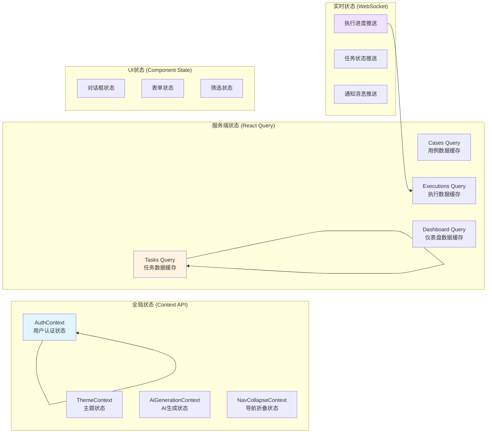
```mermaid
graph LR
    subgraph "全局状态 (Context API)"
        Auth_Context[AuthContext<br/>用户认证状态]
        Theme_Context[ThemeContext<br/>主题状态]
        AI_Context[AiGenerationContext<br/>AI生成状态]
        Nav_Context[NavCollapseContext<br/>导航折叠状态]
    end

    subgraph "服务端状态 (React Query)"
        Tasks_Query[Tasks Query<br/>任务数据缓存]
        Cases_Query[Cases Query<br/>用例数据缓存]
        Executions_Query[Executions Query<br/>执行数据缓存]
        Dashboard_Query[Dashboard Query<br/>仪表盘数据缓存]
    end

    subgraph "实时状态 (WebSocket)"
        WS_Execution[执行进度推送]
        WS_Task[任务状态推送]
        WS_Notification[通知消息推送]
    end

    subgraph "UI状态 (Component State)"
        Modal_State[对话框状态]
        Form_State[表单状态]
        Filter_State[筛选状态]
    end

    %% 连接
    Auth_Context --> Auth_Context
    Tasks_Query --> Tasks_Query
    WS_Execution --> Executions_Query

    style Auth_Context fill:#e1f5ff
    style Tasks_Query fill:#fff4e1
    style WS_Execution fill:#f0e1ff
```

### 2.3 前端路由结构

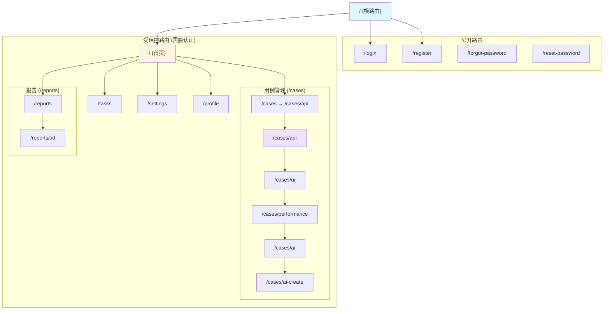
```mermaid
graph TB
    Root["/ (根路由)"]

    subgraph "公开路由"
        Login["/login"]
        Register["/register"]
        Forgot["/forgot-password"]
        Reset["/reset-password"]
    end

    subgraph "受保护路由 (需要认证)"
        Home["/ (首页)"]
        
        subgraph "用例管理 (/cases)"
            Cases_Redirect["/cases → /cases/api"]
            API_Cases["/cases/api"]
            UI_Cases["/cases/ui"]
            Perf_Cases["/cases/performance"]
            AI_Cases["/cases/ai"]
            AI_Create["/cases/ai-create"]
        end

        Tasks["/tasks"]
        
        subgraph "报告 (/reports)"
            Reports_List["/reports"]
            Report_Detail["/reports/:id"]
        end

        Settings["/settings"]
        Profile["/profile"]
    end

    Root --> Login
    Root --> Register
    Root --> Home

    Home --> Cases_Redirect
    Cases_Redirect --> API_Cases
    API_Cases --> UI_Cases
    UI_Cases --> Perf_Cases
    Perf_Cases --> AI_Cases
    AI_Cases --> AI_Create

    Home --> Tasks
    Home --> Reports_List
    Reports_List --> Report_Detail
    Home --> Settings
    Home --> Profile

    style Root fill:#e1f5ff
    style Home fill:#fff4e1
    style API_Cases fill:#f0e1ff
```

---

## 3. 后端服务架构

### 3.1 服务层次架构

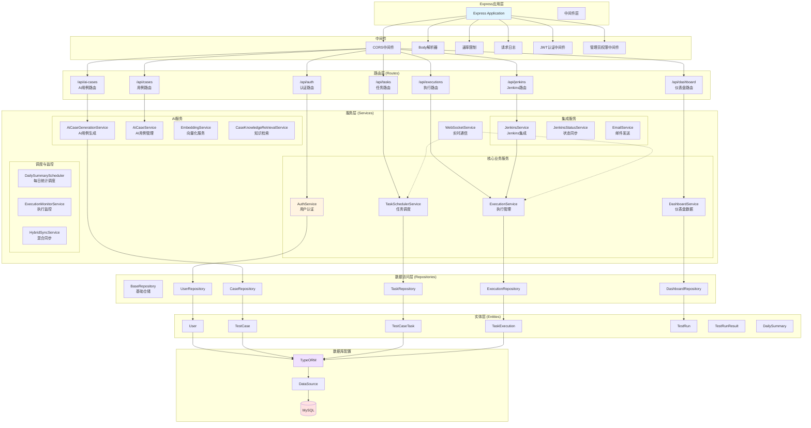
```mermaid
graph TB
    subgraph "Express应用层"
        Express_App[Express Application]
        Middleware[中间件层]
    end

    subgraph "中间件"
        CORS[CORS中间件]
        BodyParser[Body解析器]
        RateLimit[速率限制]
        RequestLogging[请求日志]
        Auth_Middleware[JWT认证中间件]
        Admin_Middleware[管理员权限中间件]
    end

    subgraph "路由层 (Routes)"
        Auth_Route["/api/auth<br/>认证路由"]
        Cases_Route["/api/cases<br/>用例路由"]
        Tasks_Route["/api/tasks<br/>任务路由"]
        Exec_Route["/api/executions<br/>执行路由"]
        Dashboard_Route["/api/dashboard<br/>仪表盘路由"]
        Jenkins_Route["/api/jenkins<br/>Jenkins路由"]
        AI_Route["/api/ai-cases<br/>AI用例路由"]
    end

    subgraph "服务层 (Services)"
        subgraph "核心业务服务"
            Auth_Svc[AuthService<br/>用户认证]
            Execution_Svc[ExecutionService<br/>执行管理]
            Task_Scheduler_Svc[TaskSchedulerService<br/>任务调度]
            Dashboard_Svc[DashboardService<br/>仪表盘数据]
        end

        subgraph "集成服务"
            Jenkins_Svc[JenkinsService<br/>Jenkins集成]
            Jenkins_Status_Svc[JenkinsStatusService<br/>状态同步]
            Email_Svc[EmailService<br/>邮件发送]
        end

        subgraph "AI服务"
            AI_Gen_Svc[AiCaseGenerationService<br/>AI用例生成]
            AI_Case_Svc[AiCaseService<br/>AI用例管理]
            Embedding_Svc[EmbeddingService<br/>向量化服务]
            Knowledge_Svc[CaseKnowledgeRetrievalService<br/>知识检索]
        end

        subgraph "调度与监控"
            Daily_Sum_Svc[DailySummaryScheduler<br/>每日统计调度]
            Exec_Monitor_Svc[ExecutionMonitorService<br/>执行监控]
            Hybrid_Sync_Svc[HybridSyncService<br/>混合同步]
        end

        WebSocket_Svc[WebSocketService<br/>实时通信]
    end

    subgraph "数据访问层 (Repositories)"
        Base_Repo[BaseRepository<br/>基础仓储]
        User_Repo[UserRepository]
        Case_Repo[CaseRepository]
        Task_Repo[TaskRepository]
        Execution_Repo[ExecutionRepository]
        Dashboard_Repo[DashboardRepository]
    end

    subgraph "实体层 (Entities)"
        User_Entity[User]
        TestCase_Entity[TestCase]
        Task_Entity[TestCaseTask]
        TaskExec_Entity[TaskExecution]
        TestRun_Entity[TestRun]
        Result_Entity[TestRunResult]
        Daily_Entity[DailySummary]
    end

    subgraph "数据库配置"
        TypeORM[TypeORM]
        DataSource[DataSource]
        MySQL[(MySQL)]
    end

    %% 连接关系
    Express_App --> CORS
    Express_App --> BodyParser
    Express_App --> RateLimit
    Express_App --> RequestLogging
    Express_App --> Auth_Middleware
    Express_App --> Admin_Middleware

    CORS --> Auth_Route
    CORS --> Cases_Route
    CORS --> Tasks_Route
    CORS --> Exec_Route
    CORS --> Dashboard_Route
    CORS --> Jenkins_Route
    CORS --> AI_Route

    Auth_Route --> Auth_Svc
    Cases_Route --> AI_Case_Svc
    Tasks_Route --> Task_Scheduler_Svc
    Exec_Route --> Execution_Svc
    Dashboard_Route --> Dashboard_Svc
    Jenkins_Route --> Jenkins_Svc
    AI_Route --> AI_Gen_Svc

    Auth_Svc --> User_Repo
    Execution_Svc --> Execution_Repo
    Task_Scheduler_Svc --> Task_Repo
    Dashboard_Svc --> Dashboard_Repo
    AI_Gen_Svc --> Case_Repo
    Jenkins_Svc --> Execution_Svc

    User_Repo --> User_Entity
    Case_Repo --> TestCase_Entity
    Task_Repo --> Task_Entity
    Execution_Repo --> TaskExec_Entity
    Dashboard_Repo --> TestRun_Entity

    User_Entity --> TypeORM
    TestCase_Entity --> TypeORM
    Task_Entity --> TypeORM
    TaskExec_Entity --> TypeORM

    TypeORM --> DataSource
    DataSource --> MySQL

    %% WebSocket连接
    WebSocket_Svc -.-> Execution_Svc
    WebSocket_Svc -.-> Task_Scheduler_Svc

    style Express_App fill:#e1f5ff
    style Auth_Svc fill:#fff4e1
    style TypeORM fill:#f0e1ff
    style MySQL fill:#ffe1e1
```

### 3.2 核心服务交互流程

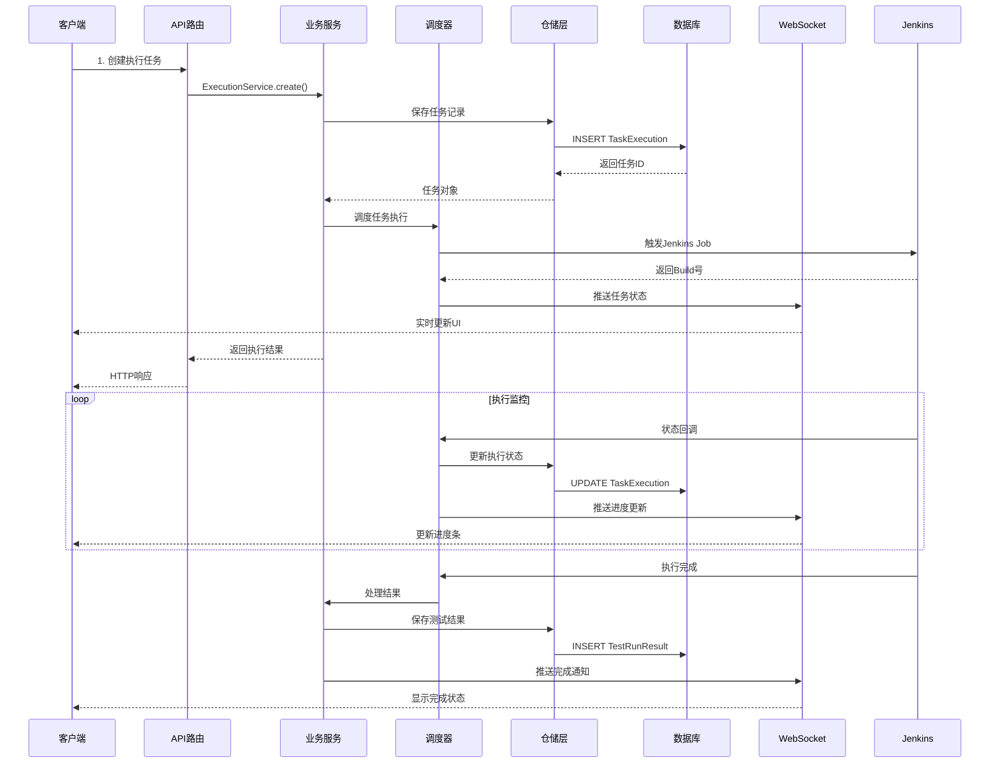
```mermaid
sequenceDiagram
    participant Client as 客户端
    participant API as API路由
    participant Service as 业务服务
    participant Scheduler as 调度器
    participant Repo as 仓储层
    participant DB as 数据库
    participant WS as WebSocket
    participant Jenkins as Jenkins

    Client->>API: 1. 创建执行任务
    API->>Service: ExecutionService.create()
    Service->>Repo: 保存任务记录
    Repo->>DB: INSERT TaskExecution
    DB-->>Repo: 返回任务ID
    Repo-->>Service: 任务对象
    Service->>Scheduler: 调度任务执行
    Scheduler->>Jenkins: 触发Jenkins Job
    Jenkins-->>Scheduler: 返回Build号
    Scheduler->>WS: 推送任务状态
    WS-->>Client: 实时更新UI
    Service-->>API: 返回执行结果
    API-->>Client: HTTP响应

    loop 执行监控
        Jenkins->>Scheduler: 状态回调
        Scheduler->>Repo: 更新执行状态
        Repo->>DB: UPDATE TaskExecution
        Scheduler->>WS: 推送进度更新
        WS-->>Client: 更新进度条
    end

    Jenkins->>Scheduler: 执行完成
    Scheduler->>Service: 处理结果
    Service->>Repo: 保存测试结果
    Repo->>DB: INSERT TestRunResult
    Service->>WS: 推送完成通知
    WS-->>Client: 显示完成状态
```

---

## 4. 数据库设计

### 4.1 核心实体关系图

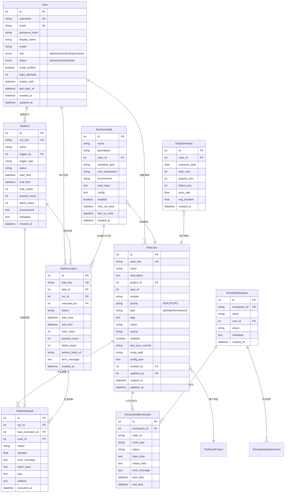
```mermaid
erDiagram
    User ||--o{ TestCase : "创建/更新"
    User ||--o{ TestRun : "触发执行"
    User ||--o{ TaskExecution : "执行任务"
    
    TestCase ||--o{ TestRunResult : "产生结果"
    TestCase ||--o{ AiCaseNodeExecution : "AI节点执行"
    TestCase }o--|| TestCaseProject : "属于项目"
    
    TestRun ||--o{ TestRunResult : "包含结果"
    TestRun ||--o{ TaskExecution : "包含任务"
    
    TaskExecution ||--o{ TestRunResult : "包含结果"
    
    TestCaseTask ||--o{ TaskExecution : "生成执行记录"
    TestCaseTask }o--|| TestCase : "关联用例"
    
    AiCaseWorkspace ||--o{ AiCaseNodeExecution : "节点执行"
    AiCaseWorkspace ||--o{ AiCaseNodeAttachment : "节点附件"
    
    DailySummary }o--|| TestCase : "统计用例"

    User {
        int id PK
        string username UK
        string email UK
        string password_hash
        string display_name
        string avatar
        enum role "admin/tester/developer/viewer"
        enum status "active/inactive/locked"
        boolean email_verified
        int login_attempts
        datetime locked_until
        datetime last_login_at
        datetime created_at
        datetime updated_at
    }

    TestCase {
        int id PK
        string case_key UK
        string name
        text description
        int project_id FK
        int repo_id
        string module
        string priority "P0/P1/P2/P3"
        string type "api/ui/performance/ai"
        text tags
        string owner
        string source
        boolean enabled
        string last_sync_commit
        string script_path
        text config_json
        int created_by FK
        int updated_by FK
        datetime created_at
        datetime updated_at
    }

    TestRun {
        int id PK
        string run_key UK
        string name
        int trigger_by FK
        string trigger_type
        string status
        datetime start_time
        datetime end_time
        int total_cases
        int passed_cases
        int failed_cases
        text environment
        text metadata
        datetime created_at
    }

    TaskExecution {
        int id PK
        string task_key UK
        int task_id FK
        int run_id FK
        int executed_by FK
        string status
        datetime start_time
        datetime end_time
        int total_cases
        int passed_cases
        int failed_cases
        string jenkins_build_url
        text error_message
        datetime created_at
    }

    TestRunResult {
        int id PK
        int run_id FK
        int task_execution_id FK
        int case_id FK
        string status
        float duration
        text error_message
        text stack_trace
        text logs
        text artifacts
        datetime executed_at
    }

    TestCaseTask {
        int id PK
        string name
        string description
        int case_id FK
        string schedule_type
        string cron_expression
        string environment
        text case_keys
        text config
        boolean enabled
        datetime next_run_time
        datetime last_run_time
        datetime created_at
    }

    DailySummary {
        int id PK
        int case_id FK
        date summary_date
        int total_runs
        int passed_runs
        int failed_runs
        float pass_rate
        float avg_duration
        datetime created_at
    }

    AiCaseWorkspace {
        int id PK
        string workspace_id UK
        string name
        int user_id FK
        string status
        text metadata
        datetime created_at
    }

    AiCaseNodeExecution {
        int id PK
        int workspace_id FK
        string node_id
        string node_type
        string status
        text input_data
        text output_data
        text error_message
        datetime start_time
        datetime end_time
    }
```

### 4.2 数据表分类

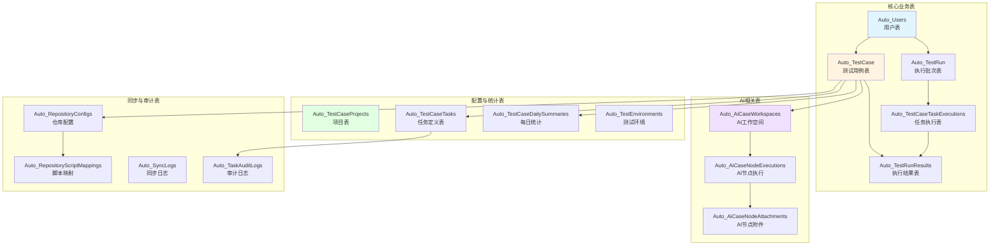
```mermaid
graph TB
    subgraph "核心业务表"
        User_Table[Auto_Users<br/>用户表]
        Case_Table[Auto_TestCase<br/>测试用例表]
        Run_Table[Auto_TestRun<br/>执行批次表]
        TaskExec_Table[Auto_TestCaseTaskExecutions<br/>任务执行表]
        Result_Table[Auto_TestRunResults<br/>执行结果表]
    end

    subgraph "AI相关表"
        Workspace_Table[Auto_AiCaseWorkspaces<br/>AI工作空间]
        NodeExec_Table[Auto_AiCaseNodeExecutions<br/>AI节点执行]
        Attachment_Table[Auto_AiCaseNodeAttachments<br/>AI节点附件]
    end

    subgraph "配置与统计表"
        Project_Table[Auto_TestCaseProjects<br/>项目表]
        Task_Table[Auto_TestCaseTasks<br/>任务定义表]
        Summary_Table[Auto_TestCaseDailySummaries<br/>每日统计]
        Env_Table[Auto_TestEnvironments<br/>测试环境]
    end

    subgraph "同步与审计表"
        Repo_Table[Auto_RepositoryConfigs<br/>仓库配置]
        Mapping_Table[Auto_RepositoryScriptMappings<br/>脚本映射]
        Sync_Table[Auto_SyncLogs<br/>同步日志]
        Audit_Table[Auto_TaskAuditLogs<br/>审计日志]
    end

    %% 关系
    User_Table --> Case_Table
    User_Table --> Run_Table
    Case_Table --> Result_Table
    Run_Table --> TaskExec_Table
    TaskExec_Table --> Result_Table

    Case_Table --> Workspace_Table
    Workspace_Table --> NodeExec_Table
    NodeExec_Table --> Attachment_Table

    Case_Table --> Task_Table
    Case_Table --> Summary_Table

    Case_Table --> Repo_Table
    Repo_Table --> Mapping_Table
    Task_Table --> Audit_Table

    style User_Table fill:#e1f5ff
    style Case_Table fill:#fff4e1
    style Workspace_Table fill:#f0e1ff
    style Project_Table fill:#e1ffe1
```

---

## 5. 部署架构

### 5.1 CI/CD 流程图

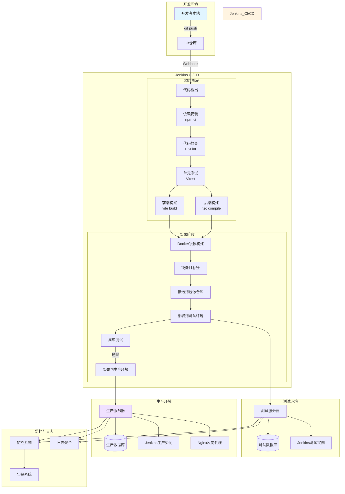
```mermaid
graph TB
    subgraph "开发环境"
        Dev[开发者本地]
        Git[Git仓库]
    end

    subgraph "Jenkins CI/CD"
        subgraph "构建阶段"
            Checkout[代码检出]
            Install[依赖安装<br/>npm ci]
            Lint[代码检查<br/>ESLint]
            Test[单元测试<br/>Vitest]
            Build_Front[前端构建<br/>vite build]
            Build_Back[后端构建<br/>tsc compile]
        end

        subgraph "部署阶段"
            Docker_Build[Docker镜像构建]
            Docker_Tag[镜像打标签]
            Docker_Push[推送到镜像仓库]
            Deploy_Test[部署到测试环境]
            Integration_Test[集成测试]
            Deploy_Prod[部署到生产环境]
        end
    end

    subgraph "测试环境"
        Test_Server[测试服务器]
        Test_DB[(测试数据库)]
        Test_Jenkins[Jenkins测试实例]
    end

    subgraph "生产环境"
        Prod_Server[生产服务器]
        Prod_DB[(生产数据库)]
        Prod_Jenkins[Jenkins生产实例]
        Nginx_Prod[Nginx反向代理]
    end

    subgraph "监控与日志"
        Monitor[监控系统]
        Log_Agg[日志聚合]
        Alert[告警系统]
    end

    %% 流程连接
    Dev -->|git push| Git
    Git -->|Webhook| Checkout
    Checkout --> Install
    Install --> Lint
    Lint --> Test
    Test --> Build_Front
    Test --> Build_Back
    Build_Front --> Docker_Build
    Build_Back --> Docker_Build

    Docker_Build --> Docker_Tag
    Docker_Tag --> Docker_Push
    Docker_Push --> Deploy_Test
    Deploy_Test --> Test_Server
    Test_Server --> Test_DB
    Test_Server --> Test_Jenkins
    Deploy_Test --> Integration_Test
    Integration_Test -->|通过| Deploy_Prod
    Deploy_Prod --> Prod_Server
    Prod_Server --> Prod_DB
    Prod_Server --> Prod_Jenkins
    Prod_Server --> Nginx_Prod

    %% 监控连接
    Test_Server --> Monitor
    Prod_Server --> Monitor
    Test_Server --> Log_Agg
    Prod_Server --> Log_Agg
    Monitor --> Alert

    style Dev fill:#e1f5ff
    style Jenkins_CI/CD fill:#fff4e1
    style Prod_Server fill:#f0e1ff
```

### 5.2 Docker容器架构

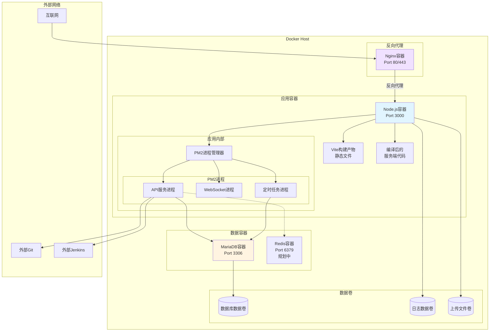
```mermaid
graph TB
    subgraph "Docker Host"
        subgraph "应用容器"
            App_Container[Node.js容器<br/>Port 3000]
            
            subgraph "应用内部"
                PM2[PM2进程管理器]
                
                subgraph "PM2进程"
                    API_Proc[API服务进程]
                    WS_Proc[WebSocket进程]
                    Scheduler_Proc[定时任务进程]
                end
            end
            
            Vite_Bundle[Vite构建产物<br/>静态文件]
            Server_Code[编译后的<br/>服务端代码]
        end

        subgraph "数据容器"
            DB_Container[MariaDB容器<br/>Port 3306]
            Redis_Container[Redis容器<br/>Port 6379<br/>规划中]
        end

        subgraph "反向代理"
            Nginx_Container[Nginx容器<br/>Port 80/443]
        end

        subgraph "数据卷"
            DB_Volume[(数据库数据卷)]
            Log_Volume[(日志数据卷)]
            Upload_Volume[(上传文件卷)]
        end
    end

    subgraph "外部网络"
        Internet[互联网]
        Git_External[外部Git]
        Jenkins_External[外部Jenkins]
    end

    %% 连接
    Nginx_Container -->|反向代理| App_Container
    App_Container --> PM2
    PM2 --> API_Proc
    PM2 --> WS_Proc
    PM2 --> Scheduler_Proc

    API_Proc --> DB_Container
    Scheduler_Proc --> DB_Container
    API_Proc -.-> Redis_Container

    App_Container --> Vite_Bundle
    App_Container --> Server_Code

    DB_Container --> DB_Volume
    App_Container --> Log_Volume
    App_Container --> Upload_Volume

    Internet --> Nginx_Container
    API_Proc --> Git_External
    API_Proc --> Jenkins_External

    style App_Container fill:#e1f5ff
    style DB_Container fill:#fff4e1
    style Nginx_Container fill:#f0e1ff
```

### 5.3 环境配置管理

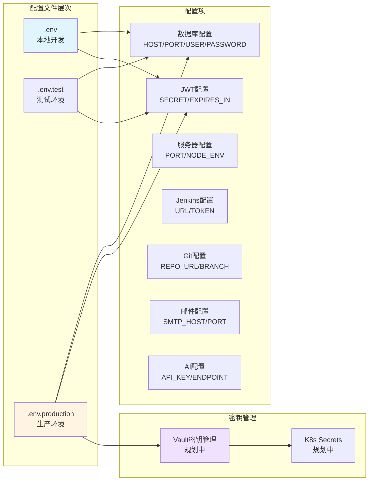
```mermaid
graph LR
    subgraph "配置文件层次"
        Env_Local[.env<br/>本地开发]
        Env_Test[.env.test<br/>测试环境]
        Env_Prod[.env.production<br/>生产环境]
    end

    subgraph "配置项"
        DB_Config[数据库配置<br/>HOST/PORT/USER/PASSWORD]
        JWT_Config[JWT配置<br/>SECRET/EXPIRES_IN]
        Server_Config[服务器配置<br/>PORT/NODE_ENV]
        Jenkins_Config[Jenkins配置<br/>URL/TOKEN]
        Git_Config[Git配置<br/>REPO_URL/BRANCH]
        Email_Config[邮件配置<br/>SMTP_HOST/PORT]
        AI_Config[AI配置<br/>API_KEY/ENDPOINT]
    end

    subgraph "密钥管理"
        Vault[Vault密钥管理<br/>规划中]
        K8s_Secrets[K8s Secrets<br/>规划中]
    end

    %% 连接
    Env_Local --> DB_Config
    Env_Test --> DB_Config
    Env_Prod --> DB_Config

    Env_Local --> JWT_Config
    Env_Test --> JWT_Config
    Env_Prod --> JWT_Config

    Env_Prod --> Vault
    Vault --> K8s_Secrets

    style Env_Local fill:#e1f5ff
    style Env_Prod fill:#fff4e1
    style Vault fill:#f0e1ff
```

---

## 6. 核心流程

### 6.1 用户认证流程

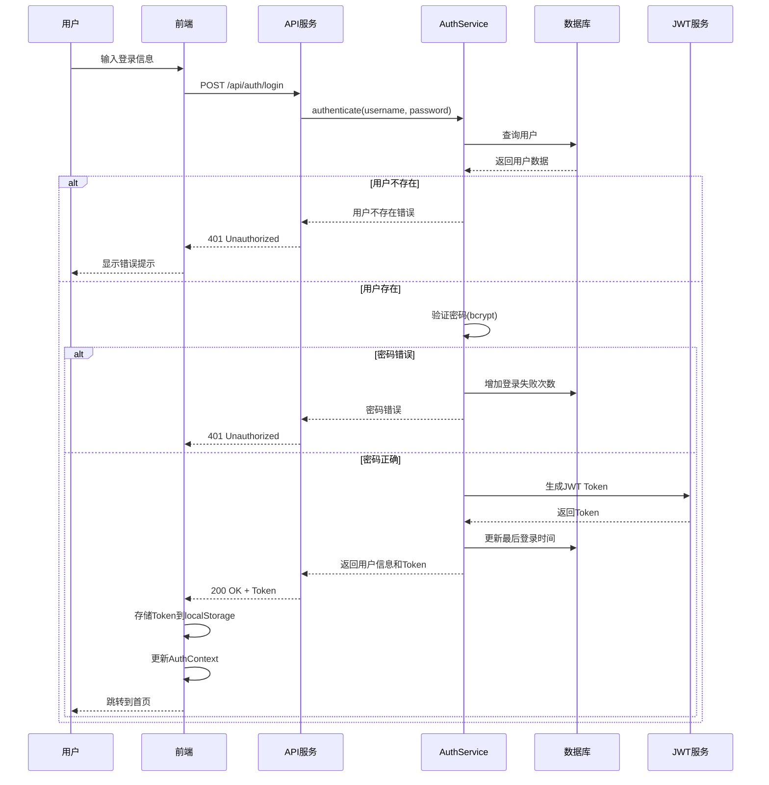
```mermaid
sequenceDiagram
    participant User as 用户
    participant Frontend as 前端
    participant API as API服务
    participant Auth as AuthService
    participant DB as 数据库
    participant JWT as JWT服务

    User->>Frontend: 输入登录信息
    Frontend->>API: POST /api/auth/login
    API->>Auth: authenticate(username, password)
    Auth->>DB: 查询用户
    DB-->>Auth: 返回用户数据

    alt 用户不存在
        Auth-->>API: 用户不存在错误
        API-->>Frontend: 401 Unauthorized
        Frontend-->>User: 显示错误提示
    else 用户存在
        Auth->>Auth: 验证密码(bcrypt)
        
        alt 密码错误
            Auth->>DB: 增加登录失败次数
            Auth-->>API: 密码错误
            API-->>Frontend: 401 Unauthorized
        else 密码正确
            Auth->>JWT: 生成JWT Token
            JWT-->>Auth: 返回Token
            Auth->>DB: 更新最后登录时间
            Auth-->>API: 返回用户信息和Token
            API-->>Frontend: 200 OK + Token
            Frontend->>Frontend: 存储Token到localStorage
            Frontend->>Frontend: 更新AuthContext
            Frontend-->>User: 跳转到首页
        end
    end
```

### 6.2 测试执行流程

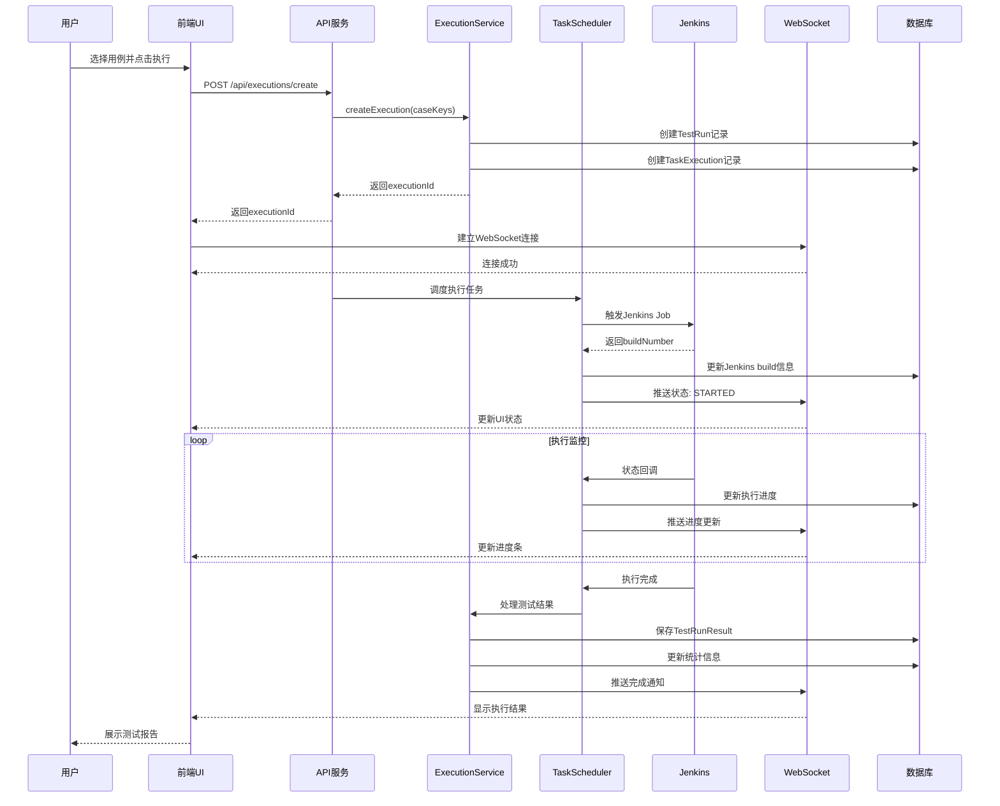
```mermaid
sequenceDiagram
    participant User as 用户
    participant UI as 前端UI
    participant API as API服务
    participant Exec as ExecutionService
    participant Scheduler as TaskScheduler
    participant Jenkins as Jenkins
    participant WS as WebSocket
    participant DB as 数据库

    User->>UI: 选择用例并点击执行
    UI->>API: POST /api/executions/create
    API->>Exec: createExecution(caseKeys)
    Exec->>DB: 创建TestRun记录
    Exec->>DB: 创建TaskExecution记录
    Exec-->>API: 返回executionId
    API-->>UI: 返回executionId

    UI->>WS: 建立WebSocket连接
    WS-->>UI: 连接成功

    API->>Scheduler: 调度执行任务
    Scheduler->>Jenkins: 触发Jenkins Job
    Jenkins-->>Scheduler: 返回buildNumber

    Scheduler->>DB: 更新Jenkins build信息
    Scheduler->>WS: 推送状态: STARTED
    WS-->>UI: 更新UI状态

    loop 执行监控
        Jenkins->>Scheduler: 状态回调
        Scheduler->>DB: 更新执行进度
        Scheduler->>WS: 推送进度更新
        WS-->>UI: 更新进度条
    end

    Jenkins->>Scheduler: 执行完成
    Scheduler->>Exec: 处理测试结果
    Exec->>DB: 保存TestRunResult
    Exec->>DB: 更新统计信息
    Exec->>WS: 推送完成通知
    WS-->>UI: 显示执行结果
    UI-->>User: 展示测试报告
```

### 6.3 AI用例生成流程

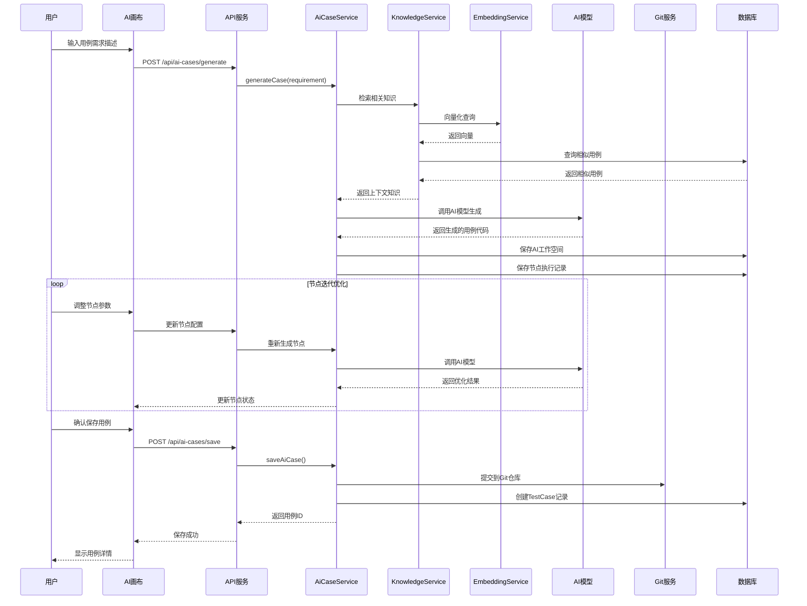
```mermaid
sequenceDiagram
    participant User as 用户
    participant UI as AI画布
    participant API as API服务
    participant AI as AiCaseService
    participant Knowledge as KnowledgeService
    participant Embed as EmbeddingService
    participant LLM as AI模型
    participant Git as Git服务
    participant DB as 数据库

    User->>UI: 输入用例需求描述
    UI->>API: POST /api/ai-cases/generate
    API->>AI: generateCase(requirement)

    AI->>Knowledge: 检索相关知识
    Knowledge->>Embed: 向量化查询
    Embed-->>Knowledge: 返回向量
    Knowledge->>DB: 查询相似用例
    DB-->>Knowledge: 返回相似用例
    Knowledge-->>AI: 返回上下文知识

    AI->>LLM: 调用AI模型生成
    LLM-->>AI: 返回生成的用例代码

    AI->>DB: 保存AI工作空间
    AI->>DB: 保存节点执行记录

    loop 节点迭代优化
        User->>UI: 调整节点参数
        UI->>API: 更新节点配置
        API->>AI: 重新生成节点
        AI->>LLM: 调用AI模型
        LLM-->>AI: 返回优化结果
        AI-->>UI: 更新节点状态
    end

    User->>UI: 确认保存用例
    UI->>API: POST /api/ai-cases/save
    API->>AI: saveAiCase()
    AI->>Git: 提交到Git仓库
    AI->>DB: 创建TestCase记录
    AI-->>API: 返回用例ID
    API-->>UI: 保存成功
    UI-->>User: 显示用例详情
```

### 6.4 定时任务调度流程

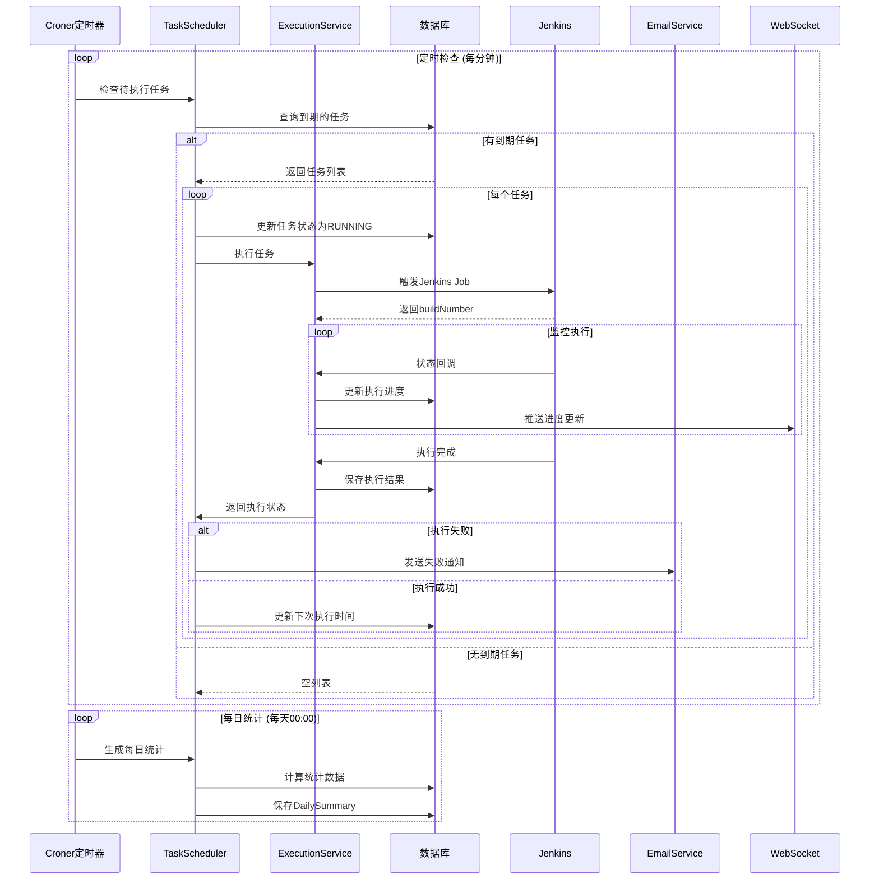
```mermaid
sequenceDiagram
    participant Cron as Croner定时器
    participant Scheduler as TaskScheduler
    participant Exec as ExecutionService
    participant DB as 数据库
    participant Jenkins as Jenkins
    participant Email as EmailService
    participant WS as WebSocket

    loop 定时检查 (每分钟)
        Cron->>Scheduler: 检查待执行任务
        Scheduler->>DB: 查询到期的任务
        
        alt 有到期任务
            DB-->>Scheduler: 返回任务列表
            
            loop 每个任务
                Scheduler->>DB: 更新任务状态为RUNNING
                Scheduler->>Exec: 执行任务
                Exec->>Jenkins: 触发Jenkins Job
                Jenkins-->>Exec: 返回buildNumber
                
                loop 监控执行
                    Jenkins->>Exec: 状态回调
                    Exec->>DB: 更新执行进度
                    Exec->>WS: 推送进度更新
                end
                
                Jenkins->>Exec: 执行完成
                Exec->>DB: 保存执行结果
                Exec->>Scheduler: 返回执行状态
                
                alt 执行失败
                    Scheduler->>Email: 发送失败通知
                else 执行成功
                    Scheduler->>DB: 更新下次执行时间
                end
            end
        else 无到期任务
            DB-->>Scheduler: 空列表
        end
    end

    loop 每日统计 (每天00:00)
        Cron->>Scheduler: 生成每日统计
        Scheduler->>DB: 计算统计数据
        Scheduler->>DB: 保存DailySummary
    end
```

---

## 附录

### A. 技术栈版本信息

| 分类 | 技术 | 版本 | 用途 |
|------|------|------|------|
| **前端框架** | React | 18.2.0 | UI框架 |
| | TypeScript | 5.3.3 | 类型系统 |
| | Vite | 5.0.12 | 构建工具 |
| **前端UI** | TailwindCSS | 3.4.1 | 样式框架 |
| | Radix UI | 多版本 | 组件库 |
| | Lucide React | 0.312.0 | 图标库 |
| **前端状态** | React Query | 4.36.1 | 服务端状态管理 |
| | Wouter | 2.12.1 | 路由管理 |
| **前端图表** | Recharts | 3.6.0 | 图表库 |
| **后端框架** | Express | 4.18.2 | Web框架 |
| | Node.js | 20.x | 运行时 |
| **后端ORM** | TypeORM | 0.3.28 | 数据库ORM |
| **数据库** | MySQL/MariaDB | - | 关系数据库 |
| **认证** | JWT | 9.0.3 | Token认证 |
| | bcryptjs | 3.0.3 | 密码加密 |
| **实时通信** | Socket.IO | 4.8.3 | WebSocket |
| **定时任务** | Croner | 10.0.1 | 定时调度 |
| **集成** | Simple Git | 3.30.0 | Git操作 |
| | Nodemailer | 7.0.12 | 邮件发送 |
| **容器化** | Docker | - | 容器化部署 |
| **CI/CD** | Jenkins | - | 持续集成 |

### B. 目录结构

```
Automation_Platform/
├── src/                    # 前端源码
│   ├── api/               # API客户端
│   ├── components/        # React组件
│   ├── config/            # 配置文件
│   ├── constants/         # 常量定义
│   ├── contexts/          # Context上下文
│   ├── hooks/             # 自定义Hooks
│   ├── lib/               # 工具库
│   ├── pages/             # 页面组件
│   ├── services/          # 前端服务
│   ├── types/             # 类型定义
│   └── utils/             # 工具函数
├── server/                 # 后端源码
│   ├── config/            # 配置
│   ├── entities/          # TypeORM实体
│   ├── middleware/        # Express中间件
│   ├── repositories/      # 数据仓储
│   ├── routes/            # API路由
│   ├── services/          # 业务服务
│   └── utils/             # 工具函数
├── shared/                 # 共享类型
├── docs/                   # 文档
├── test_case/             # 测试用例
├── scripts/               # 脚本
├── public/                # 静态资源
└── configs/               # 构建配置
```

### C. 关键性能指标

| 指标 | 目标值 | 说明 |
|------|--------|------|
| 首页加载时间 | < 2s | 首屏渲染时间 |
| API响应时间 | < 500ms | 平均响应时间 |
| WebSocket延迟 | < 100ms | 消息推送延迟 |
| 并发用户数 | > 100 | 同时在线用户 |
| 测试并发数 | > 50 | 同时执行测试数 |
| 数据库查询 | < 100ms | 平均查询时间 |

---

**文档版本**: v1.0  
**最后更新**: 2026年  
**维护者**: Automation Platform Team
