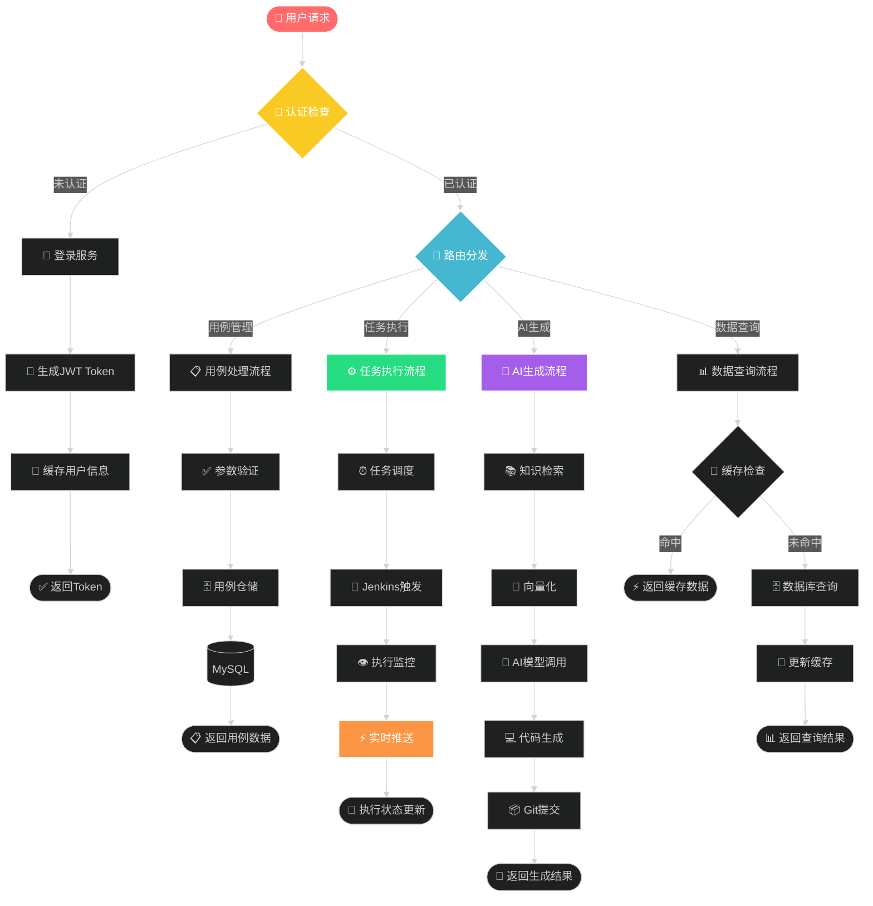
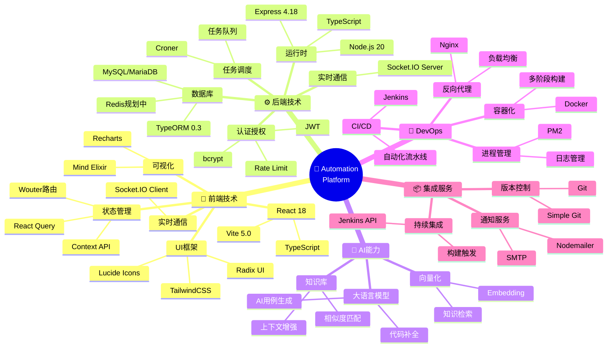
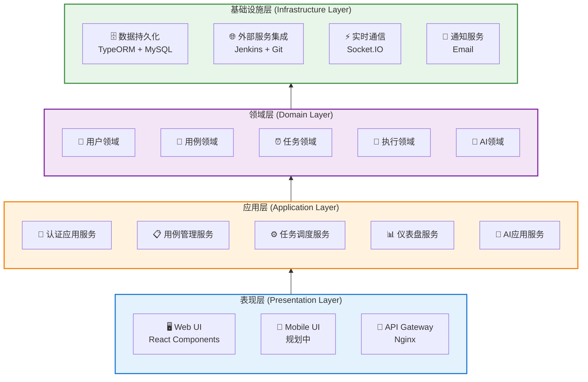
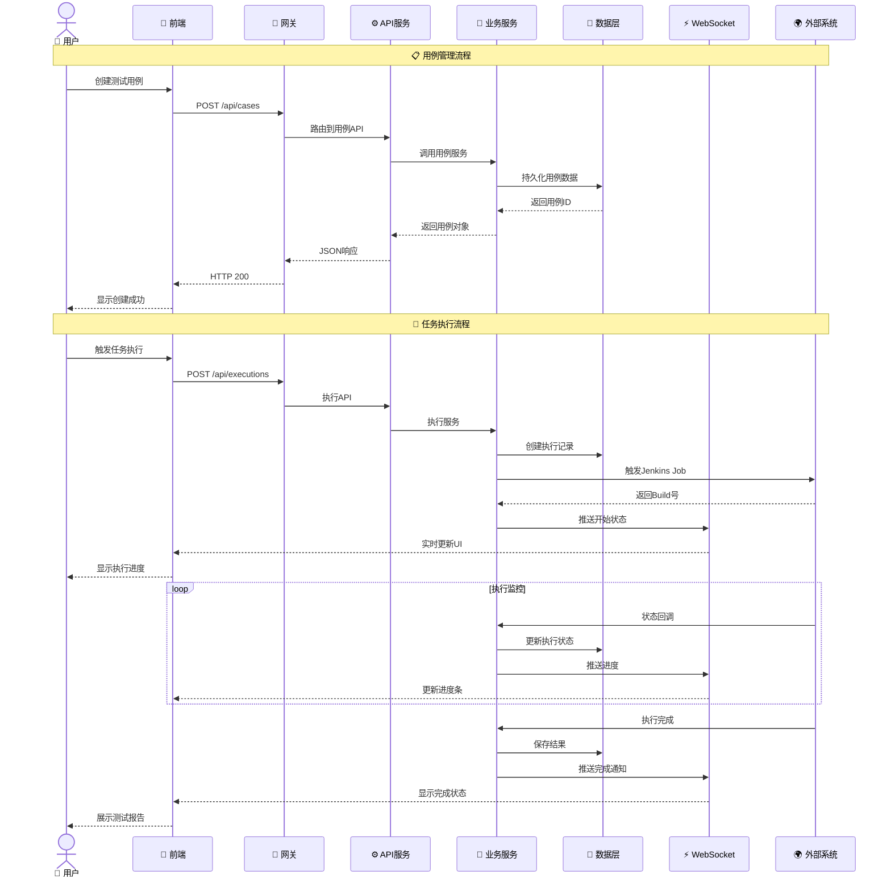
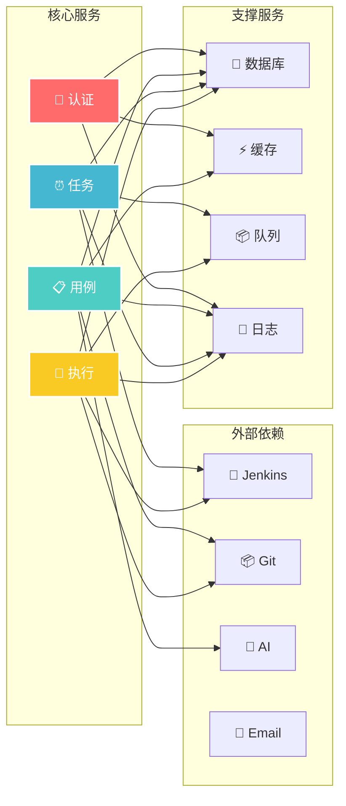
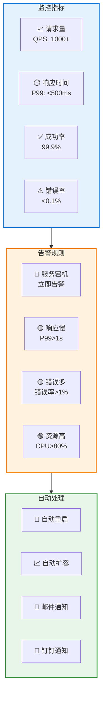
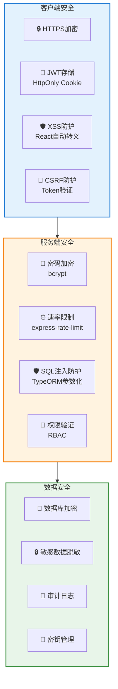

# 🎆 Automation Platform 服务架构图

> 💡 **烟花技术架构图** - 以视觉化方式展示系统服务全景

---

## 🌟 核心服务全景图

```mermaid
%%{init: {'theme': 'base', 'themeVariables': { 'primaryColor': '#ff6b6b', 'primaryTextColor': '#fff', 'primaryBorderColor': '#ff6b6b', 'lineColor': '#4ecdc4', 'secondaryColor': '#45b7d1', 'tertiaryColor': '#f9ca24'}}}%%
graph TB
    subgraph CLIENT["🌐 客户端层"]
        Browser["🖥️ Web浏览器<br/>React SPA"]
        Mobile["📱 移动端<br/>规划中"]
    end

    subgraph FRONTEND["🎨 前端服务层"]
        subgraph UI["用户界面"]
            Dashboard["📊 仪表盘模块"]
            CaseModule["📝 用例管理模块"]
            TaskModule["⚙️ 任务调度模块"]
            ReportModule["📈 报告分析模块"]
            AIModule["🤖 AI生成模块"]
        end
        
        subgraph STATE["状态管理"]
            ReactQuery["🔄 React Query<br/>服务端状态"]
            Context["🎯 Context API<br/>全局状态"]
            WebSocket["⚡ Socket.IO Client<br/>实时状态"]
        end
    end

    subgraph GATEWAY["🚪 网关层"]
        Nginx["🌐 Nginx<br/>反向代理 & 负载均衡"]
    end

    subgraph BACKEND["⚙️ 后端服务层"]
        subgraph API["RESTful API"]
            AuthAPI["🔐 /api/auth<br/>认证服务"]
            CaseAPI["📋 /api/cases<br/>用例服务"]
            TaskAPI["⏰ /api/tasks<br/>任务服务"]
            ExecAPI["🚀 /api/executions<br/>执行服务"]
            DashboardAPI["📊 /api/dashboard<br/>仪表盘服务"]
            JenkinsAPI["🔧 /api/jenkins<br/>Jenkins集成"]
            AIAPI["🧠 /api/ai-cases<br/>AI生成服务"]
        end

        subgraph CORE["核心业务服务"]
            AuthService["🔐 认证服务<br/>JWT + bcrypt"]
            ExecutionEngine["🚀 执行引擎<br/>任务调度 & 监控"]
            TaskScheduler["⏰ 任务调度器<br/>Cron定时任务"]
            DashboardService["📊 仪表盘服务<br/>数据聚合 & 统计"]
        end

        subgraph INTEGRATION["集成服务"]
            JenkinsService["🔧 Jenkins集成<br/>Job触发 & 状态同步"]
            GitService["📦 Git服务<br/>代码同步"]
            EmailService["📧 邮件服务<br/>通知推送"]
        end

        subgraph AI["AI服务集群"]
            AIGenerator["🧠 AI生成引擎<br/>用例自动生成"]
            Embedding["🔢 向量化服务<br/>知识向量化"]
            KnowledgeRetrieval["📚 知识检索<br/>相似度匹配"]
        end

        subgraph REALTIME["实时通信"]
            WebSocketServer["⚡ WebSocket服务<br/>实时推送"]
        end
    end

    subgraph DATA["💾 数据层"]
        subgraph STORAGE["存储服务"]
            MySQL["🗄️ MySQL/MariaDB<br/>关系数据库"]
            Redis["⚡ Redis<br/>缓存规划中"]
        end
        
        subgraph REPO["数据访问层"]
            UserRepo["👤 用户仓储"]
            CaseRepo["📋 用例仓储"]
            TaskRepo["⏰ 任务仓储"]
            ExecRepo["🚀 执行仓储"]
        end
    end

    subgraph EXTERNAL["🌍 外部系统"]
        JenkinsServer["🔧 Jenkins服务器"]
        GitRepo["📦 Git仓库"]
        SMTPServer["📧 SMTP服务器"]
        AIModel["🤖 AI模型服务"]
    end

    subgraph INFRA["🏗️ 基础设施"]
        Docker["🐳 Docker容器"]
        PM2["🔄 PM2进程管理"]
        Jenkins["🔧 Jenkins CI/CD"]
    end

    %% 客户端到前端
    Browser --> Dashboard
    Browser --> CaseModule
    Browser --> TaskModule
    Mobile -.-> Dashboard

    %% 前端内部连接
    Dashboard --> ReactQuery
    CaseModule --> ReactQuery
    TaskModule --> ReactQuery
    AIModule --> Context
    
    ReactQuery --> WebSocket
    Context --> WebSocket

    %% 前端到网关
    Dashboard --> Nginx
    CaseModule --> Nginx
    TaskModule --> Nginx
    ReportModule --> Nginx
    AIModule --> Nginx

    %% 网关到API
    Nginx --> AuthAPI
    Nginx --> CaseAPI
    Nginx --> TaskAPI
    Nginx --> ExecAPI
    Nginx --> DashboardAPI
    Nginx --> JenkinsAPI
    Nginx --> AIAPI
    Nginx --> WebSocketServer

    %% API到服务
    AuthAPI --> AuthService
    CaseAPI --> AIGenerator
    TaskAPI --> TaskScheduler
    ExecAPI --> ExecutionEngine
    DashboardAPI --> DashboardService
    JenkinsAPI --> JenkinsService
    AIAPI --> AIGenerator

    %% 服务到数据访问层
    AuthService --> UserRepo
    ExecutionEngine --> ExecRepo
    TaskScheduler --> TaskRepo
    DashboardService --> ExecRepo
    AIGenerator --> CaseRepo

    %% 数据访问层到数据库
    UserRepo --> MySQL
    CaseRepo --> MySQL
    TaskRepo --> MySQL
    ExecRepo --> MySQL

    %% 服务间通信
    ExecutionEngine --> TaskScheduler
    JenkinsService --> ExecutionEngine
    WebSocketServer -.-> ExecutionEngine
    WebSocketServer -.-> TaskScheduler

    %% AI服务链
    AIGenerator --> Embedding
    Embedding --> KnowledgeRetrieval
    KnowledgeRetrieval --> CaseRepo

    %% 外部系统集成
    JenkinsService --> JenkinsServer
    GitService --> GitRepo
    EmailService --> SMTPServer
    AIGenerator --> AIModel
    ExecutionEngine --> GitRepo

    %% 基础设施
    Docker --> PM2

    %% 样式
    style CLIENT fill:#e1f5ff,stroke:#0066cc,stroke-width:3px
    style FRONTEND fill:#fff4e1,stroke:#ff9900,stroke-width:3px
    style GATEWAY fill:#ffe1e1,stroke:#ff0000,stroke-width:3px
    style BACKEND fill:#f0e1ff,stroke:#9900ff,stroke-width:3px
    style DATA fill:#e1ffe1,stroke:#00cc00,stroke-width:3px
    style EXTERNAL fill:#fff0f5,stroke:#ff69b4,stroke-width:3px
    style INFRA fill:#f5f5dc,stroke:#8b4513,stroke-width:3px
```

---

## 🔥 服务交互火焰图

---

## 💫 技术栈星系图

---

## 🎯 服务分层架构

---

## 🌊 数据流动态图

---

## 🔥 服务依赖矩阵

---

## 📊 服务健康度监控

---

## 🎨 技术选型对比

| 分类 | 技术选型 | 备选方案 | 选择理由 |
|------|---------|---------|---------|
| **前端框架** | React 18 | Vue 3, Angular | 生态成熟、组件丰富、团队熟悉 |
| **构建工具** | Vite | Webpack, Parcel | 开发体验好、构建速度快 |
| **状态管理** | React Query | Redux, MobX | 服务端状态管理优秀、缓存机制完善 |
| **UI框架** | TailwindCSS + Radix | Ant Design, MUI | 高度可定制、性能优秀 |
| **后端框架** | Express | Koa, NestJS | 生态成熟、中间件丰富 |
| **ORM** | TypeORM | Prisma, Sequelize | TypeScript支持好、装饰器语法优雅 |
| **数据库** | MySQL | PostgreSQL, MongoDB | 关系型数据、事务支持完善 |
| **实时通信** | Socket.IO | WebSocket, SSE | 双向通信、自动重连、房间管理 |
| **容器化** | Docker | Podman, LXC | 生态完善、CI/CD集成好 |
| **CI/CD** | Jenkins | GitLab CI, GitHub Actions | 功能强大、插件丰富 |

---

## 🚀 性能优化策略

### 前端优化
- ✅ 代码分割（React.lazy + Suspense）
- ✅ 资源懒加载
- ✅ 虚拟滚动（@tanstack/react-virtual）
- ✅ 缓存策略（React Query staleTime）
- ✅ 防抖节流

### 后端优化
- ✅ 数据库索引优化
- ✅ 查询优化（避免N+1问题）
- ✅ 连接池管理
- ✅ 异步处理（Promise.all）
- ✅ 缓存热点数据

### 网络优化
- ✅ Gzip压缩
- ✅ CDN加速
- ✅ HTTP/2
- ✅ WebSocket长连接

---

## 🔐 安全架构

---

## 📈 扩展性设计

### 水平扩展
- 🔄 无状态服务设计
- 🔄 负载均衡（Nginx）
- 🔄 会话共享（Redis）
- 🔄 数据库读写分离

### 垂直扩展
- 📦 微服务拆分
- 📦 服务网格（规划中）
- 📦 消息队列（规划中）
- 📦 分布式追踪（规划中）

### 功能扩展
- 🔌 插件化架构
- 🔌 钩子机制
- 🔌 自定义扩展点
- 🔌 配置驱动

---

## 🎯 服务SLA

| 服务 | 可用性目标 | 响应时间目标 | 备注 |
|------|-----------|-------------|------|
| **认证服务** | 99.99% | <200ms | 核心服务 |
| **用例服务** | 99.95% | <300ms | 核心服务 |
| **任务服务** | 99.90% | <500ms | 核心服务 |
| **执行服务** | 99.90% | <1000ms | 资源密集 |
| **AI服务** | 99.00% | <5000ms | 依赖外部AI |
| **Jenkins集成** | 99.00% | 不定 | 依赖Jenkins |

---

**文档版本**: v1.0  
**创建时间**: 2024年  
**维护团队**: Automation Platform Team  
**架构图风格**: 🎆 烟花技术架构图
