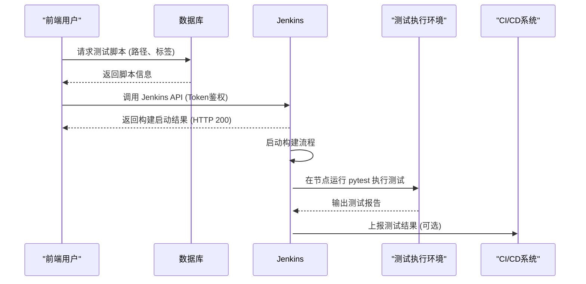

```mermaid
sequenceDiagram
    participant 用户 as "前端用户"
    participant 数据库
    participant Jenkins
    participant Env as "测试执行环境"
    participant CI as "CI/CD系统"

    用户->>数据库: 请求测试脚本 (路径、标签)
    数据库-->>用户: 返回脚本信息
    用户->>Jenkins: 调用 Jenkins API (Token鉴权)
    Jenkins-->>用户: 返回构建启动结果 (HTTP 200)
    Jenkins->>+Jenkins: 启动构建流程
    Jenkins->>Env: 在节点运行 pytest 执行测试
    Env-->>Jenkins: 输出测试报告
    Jenkins->>CI: 上报测试结果 (可选)
```