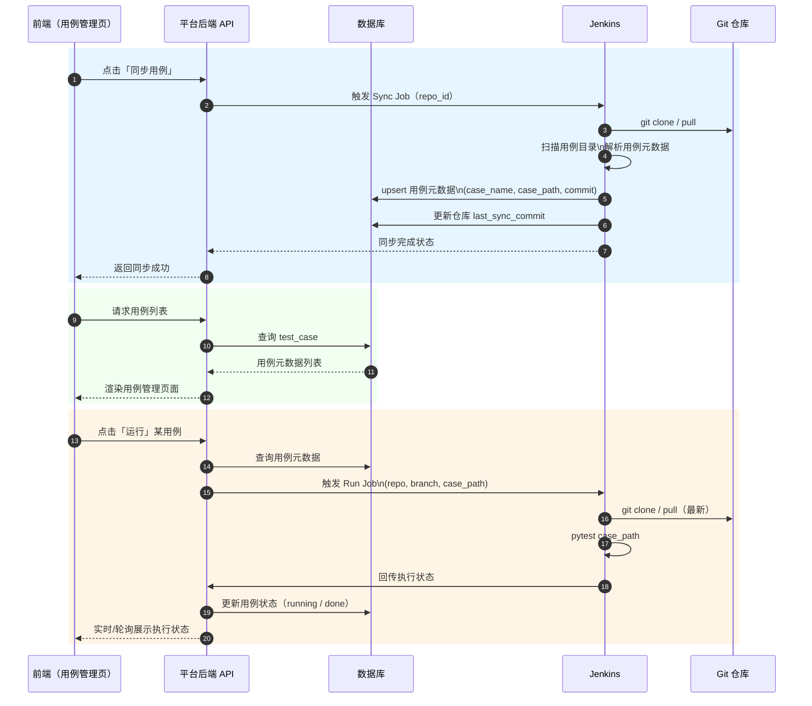

```mermaid
sequenceDiagram
    autonumber

    participant FE as 前端（用例管理页）
    participant API as 平台后端 API
    participant DB as 数据库
    participant J as Jenkins
    participant G as Git 仓库

    %% ========== 用例同步流程 ==========
    rect rgb(230, 245, 255)
    FE->>API: 点击「同步用例」
    API->>J: 触发 Sync Job（repo_id）
    J->>G: git clone / pull
    J->>J: 扫描用例目录\n解析用例元数据
    J->>DB: upsert 用例元数据\n(case_name, case_path, commit)
    J->>DB: 更新仓库 last_sync_commit
    J-->>API: 同步完成状态
    API-->>FE: 返回同步成功
    end

    %% ========== 用例列表展示 ==========
    rect rgb(240, 255, 240)
    FE->>API: 请求用例列表
    API->>DB: 查询 test_case
    DB-->>API: 用例元数据列表
    API-->>FE: 渲染用例管理页面
    end

    %% ========== 单用例执行流程 ==========
    rect rgb(255, 245, 230)
    FE->>API: 点击「运行」某用例
    API->>DB: 查询用例元数据
    API->>J: 触发 Run Job\n(repo, branch, case_path)
    J->>G: git clone / pull（最新）
    J->>J: pytest case_path
    J->>API: 回传执行状态
    API->>DB: 更新用例状态（running / done）
    API-->>FE: 实时/轮询展示执行状态
    end
```
