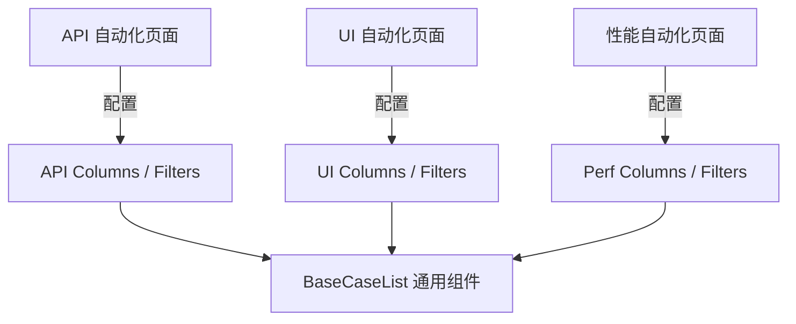

```mermaid
flowchart TD
Base[BaseCaseList 通用组件]


APIPage[API 自动化页面]
UIPage[UI 自动化页面]
PerfPage[性能自动化页面]


APIConfig[API Columns / Filters]
UIConfig[UI Columns / Filters]
PerfConfig[Perf Columns / Filters]


APIPage -->|配置| APIConfig
UIPage -->|配置| UIConfig
PerfPage -->|配置| PerfConfig


APIConfig --> Base
UIConfig --> Base
PerfConfig --> Base

```